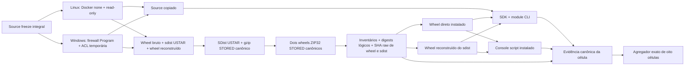
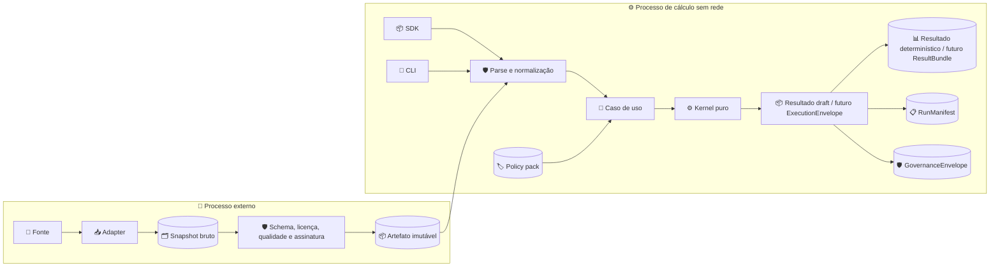

# Arquitetura do Financial Planning SDK Brasil

_Contrato arquitetural e primeiro corte implementado · 10 de agosto de 2026_

---

## 📋 Estado e decisão

O repositório contém tooling de contratos/governança/conformance e um primeiro SDK/CLI implementado para `deterministic_cashflow_ledger`. Ele calcula PV com fatores fornecidos e reproduz postagens, transferências e retornos; não implementa planejamento financeiro amplo nem regra brasileira. A arquitetura continua um **monólito modular local-first**. Microsserviços, banco central, plugin discovery, API web e rede durante cálculo estão fora do MVP.

A decisão fundacional está em [ADR 0001](decisions/0001-foundation-and-scope.md), a semântica de avaliação em [ADR 0002](decisions/0002-valuation-claims-and-survival.md), o corte executável em [ADR 0003](decisions/0003-local-deterministic-vertical.md), a fronteira de conformance parcial em [ADR 0004](decisions/0004-local-sdk-conformance-boundary.md), o pack empacotado local em [ADR 0005](decisions/0005-bundled-reference-acceptance-pack.md), o fechamento de contexto/API em [ADR 0006](decisions/0006-explicit-decimal-context-and-mapping-boundary.md), a integridade dos value objects/perfil fechado de schema em [ADR 0007](decisions/0007-opaque-value-objects-and-closed-schema-profile.md), a matriz instalada no [ADR 0008](decisions/0008-installed-offline-portability-matrix.md), o host-trust AppContainer no [ADR 0009](decisions/0009-appcontainer-powershell-host-trust.md), a boundary Windows completa no [ADR 0010](decisions/0010-full-windows-appcontainer-boundary.md) e o backend de build seguro no [ADR 0011](decisions/0011-secure-build-backend-baseline.md).

## ⚙️ Camadas e dependências

| Camada | Responsabilidade | Pode depender de |
| --- | --- | --- |
| `contracts` | quatro schemas públicos Draft 2020-12 sob perfil stdlib fechado, erros e serialização canônica | nenhuma camada de runtime |
| `interfaces` | SDK Python e CLI | contratos e aplicação |
| `application` | parse, validação semântica, normalização e casos de uso | contratos, domínio, ports |
| `ports` | protocolos para solver, cenário, relógio e artefatos externos | contratos; nenhuma infraestrutura concreta |
| `domain/kernel` | dinheiro, tempo, ledger, valuation, necessidades e métricas | biblioteca padrão e primitivas numéricas aprovadas |
| `br_policy` | artefatos declarativos bitemporais | contratos; nunca código executável no pack |
| `resolvers` | verifica policy/data artifacts já obtidos | ports e infraestrutura externa |
| `adapters` | rede, formatos e provedores | infraestrutura; nunca importado pelo kernel |
| `reporting` | transforma `ResultBundle` em representação | contratos; não recalcula métricas |
| `verification` | adapters, manifests, propriedades e mutações locais | somente SDK público e corpus draft; nunca runtime de produto |

Regras de importação:

- kernel não importa CLI, HTTP, dataframe, solver, Pydantic ou adapter;
- SDK e CLI chamam o mesmo caso de uso;
- `compute` recebe artefatos imutáveis, nunca cliente HTTP ou URL;
- policy packs são data-only, assinados, revisados e com prazo;
- backend de solver, cenário ou portfólio é port opcional e retorna diagnósticos completos;
- nenhuma narrativa pode alterar input, política, modelo ou resultado após o manifesto.

## ✅ Corte implementado

```text
src/financial_planning_sdk_br/
  _schema_validation.py perfil fechado dos quatro schemas públicos empacotados
  _value_object.py     fachadas seladas e estado imutável ligado à identidade
  numeric.py        Context Decimal explícito, dinheiro BRL e centavos inteiros
  jsonio.py         JSON estrito, budgets e FPBR-C14N-1
  contracts.py      acesso por ID e digest aos JSON Schemas empacotados
  deterministic.py boundary JsonObject exata, snapshot estrito, PV e replay do ledger
  errors.py         reason codes e relatórios redigidos
  reference.py      runner fechado do pack sintético empacotado
  cli.py            validate/compute/reference sobre os mesmos casos de uso

tests/vectors/sdk/v1/manifest.json  partição fechada 7 suportados + 14 fora do escopo
scripts/validate_sdk_conformance.py subprocesso, propriedades e mutações locais
scripts/freeze_source_snapshot.py  manifesto de handoff local ordenado por bytes UTF-8
```

`compute_deterministic` mantém application+kernel juntos no primeiro vertical. A extração em submódulos só ocorrerá quando uma segunda família de cálculo e testes justificar a fronteira. A API pública aceita somente `JsonObject`: `dict` exata na raiz e, recursivamente, apenas `dict`, `list`, `str`, `int`, `bool` e `None` exatos. Subclasses, custom `Mapping` e custom containers são recusados antes de walker/encoder chamar seus protocolos; código Python arbitrário fica fora da boundary, sem alegação de isolamento. `JsonScalar`, `JsonValue` e `JsonObject` mantêm o typing público sem `Any`.

A API preflights e canonicaliza o grafo sob 1 MiB/76.814 nós/profundidade 32 e então faz strict reparse; esse novo snapshot `FPBR-C14N-1` é a única entrada do parser de negócio. A CLI apenas precede a mesma etapa com aquisição limitada dos bytes do arquivo. A dataclass interna não é authority e não pode ser usada por construção manual ou `replace()` para chegar a `computed`.

Os quatro value objects públicos (`ValidationIssue`, `ValidationReport`, `DeterministicResult` e `ReferenceAcceptanceReport`) são fachadas opacas seladas, não tuples. O estado imutável fica fora da instância, ligado à identidade e ao tipo público exato por weak reference e registrado somente depois de a fábrica fechar canonicalidade, bindings e schema. Um shell de construção base não possui estado confiável e a instância não tem `__dict__` ou slot de payload. Subclass comum é recusada; mixin à esquerda ou metaclass hostil pode suprimir o hook, mas a classe resultante fica inerte em toda factory, operação, método ou descriptor herdado do SDK. Uma troca de `__class__` entre layouts compatíveis também fica inerte até a restauração, que recupera somente o estado original. A guarda não virtual de tipo/registro precede helpers qualificados pela classe; `copy`/`deepcopy` preservam identidade somente após revalidação, e pickle é recusado. Código que substitui o próprio método público no mesmo processo fica fora da claim.

PV usa um `Context` novo por operação, fixo em precisão 128, half-even, expoentes ±127, clamp zero, flags limpas e traps exatos; a única exceção é a fronteira monetária que permite `Inexact`/`Rounded`. Os budgets de 38 algarismos para dinheiro, fator de desconto e taxa de retorno são constantes de domínio separadas. Ties `±0.005`/`±0.015` usam half-even simétrico em PV e ganho de retorno. O ledger converte dinheiro validado em inteiros de centavos, aplica saldos/postagens/transferências e reconcilia a identidade inteira; cada retorno usa o saldo corrente produzido pelo evento anterior e somente seu ganho volta ao produto Decimal explícito antes de ser quantizado. A identidade separa postagens, retorno de investimento e transferências; retorno não é rotulado como fluxo externo. Overflow do domínio e quebra de invariante numérico são diagnósticos distintos e nenhum contexto/flag do chamador é observado como input implícito.

O contrato executável é deliberadamente menor que os schemas 0.0 de governança: exige `use_context` não client-specific, sem recomendação e sem execução; produz resultado draft próprio, não `ExecutionEnvelope` aprovado. A existência de aritmética não promove classe regulatória nem release.

O diagnóstico de SDK também é menor que o harness matemático formal. O worker carrega exclusivamente o package público e o adapter de tradução dos sete vetores; 71 propriedades em sete famílias, um gate do pack corrente e 23 mutações vivem fora do runtime. O challenger separado usa parser lexical, `Fraction`, inteiros e `divmod`, sem importar Decimal ou o kernel. Os casos isolam sinal/ties, domínios 38/39, saldo corrente sequencial, contexto hostil, bound de 4.096 termos e boundary de tipos exatos. Três mutantes compostos têm cardinalidade, roster e kill cases obrigatórios; survivor, crash, timeout, não viabilidade ou falta de kill obrigatório falha o gate. O manifesto liga fingerprints ao corpus e fecha os 14 IDs não implementados. Esses digests são locais e não autenticados. O relatório não pode trocar `official_21_vector_sut_conformance=not_evaluated` por PASS nem usar seu verde para release.

O Reference Acceptance Pack é uma quarta superfície local de verificação, menor que esse diagnóstico. Ele viaja no package para observar reprodução de três outputs candidatos sem depender da árvore `tests/`. API e CLI chamam o mesmo runner corrente v2 e emitem bytes canônicos idênticos; expected outputs, roster, derivações e digests canônicos separados de request/assertions/manifesto são fechados antes da execução. O arquivo v1 permanece empacotado e congelado byte a byte como fixture histórica; v2 muda somente identidade/digests dependentes e o expected de `validate` para o `ValidationReport` v2, preservando os dois requests/outputs `compute`. Como pack e código pertencem ao mesmo checkout, o report declara `repository_local_untrusted` e `reference_independence=not_claimed`: é controle de drift/onboarding, não oracle, benchmark independente, supply-chain attestation ou authority.

O pipeline do pack é fail-closed e ordenado: acumular short reads até EOF ou 1 MiB + 1 byte → rejeitar excesso antes de hash → validar UTF-8/JSON/budgets/lone surrogates → canonicalizar → validar forma/versões/constantes/roster/rotas/derivações e digests de request/expected/assertions/manifesto → comparar digest canônico do pack → executar os três casos. JSON Pointer limita lexicalmente o índice antes de `int()`. A validação estrutural precede o digest global para que um drift receba classe acionável, mas não chama o SUT como preflight de integridade: uma exceção do validator durante o caso `validate` continua sendo falha de execução do caso. O reference report v2 usa diagnostics fechados e não sensíveis (`code`, `location`, `scope`, `remediation_id`) e explicita se `pack_sha256` representa bytes raw, `FPBR-C14N-1` ou não está disponível. O report v1 draft local foi superado sem publicação; o pack v1 não foi sobrescrito e seu SHA-256 raw permanece `b3e5c8078a7258d8df521bb5c8843ef371feeaf681fb6710a6cd57a45918c18c`.

`jsonio` faz preflight iterativo de nesting antes de `json.loads`, com limite 32 compatível com a travessia de nós, rejeita lone surrogates em chaves/valores e converte `RecursionError`/falha Unicode residual em `JsonContractError`. Seu leitor binário limitado tolera short reads e só termina ao provar EOF ou acumular o byte budget + 1. O default genérico, `contracts.py` e o Reference Pack continuam em 1 MiB/20.000 nós. CLI e SDK determinísticos passam o teto de request derivado do schema, 1 MiB/76.814 nós; o resultado imutável usa 5.180.619 bytes/108.065 nós, também derivados do schema, tanto para canonicalização quanto para `to_dict`. Essa separação permite o roster público de 4.096 cashflows sem ampliar aquisição ou canonicalização do pack.

`_schema_validation` é um perfil fail-closed apenas para os quatro schemas empacotados, não um validator geral de Draft 2020-12. `contracts.py` fixa ID e SHA-256 de cada recurso. O perfil enumera keywords, refs locais diretos, `date`, a extensão de algarismos significativos e os 17 patterns atuais; qualquer drift não suportado é erro de schema. `$schema`, `$id` e `$defs` só existem na raiz; definição e token de ref usam `[A-Za-z_][A-Za-z0-9_.-]*`, e o grafo completo precisa resolver sem ciclo antes do matching. Recursão residual é normalizada na fronteira do schema ou da instância. Keywords desconhecidas são recusadas por política local e `date` é assertion local, embora o Draft permita extensões e use `format` como annotation por default. Siblings de `$ref` são aplicados. `pattern` mantém search semantics; somente os 16 patterns já ancorados ao fim recebem guarda absoluta para alinhar Python à expectativa ECMAScript diante de LF final. A matriz diferencial cobre também CR, U+0085, U+2028 e U+2029.

`ValidationReport` é um envelope público separado, com schema/acessor próprios. O coletor conta todas as violações, materializa apenas o prefixo de descoberta de até 128 e ordena esse prefixo. O wire não duplica contadores: `truncation.status=complete` não carrega total, enquanto `truncated` carrega somente `omitted_issue_count`; o accessor `issue_count` deriva `len(issues)+omitted_issue_count`. Pointer/mensagem aceitam somente ASCII imprimível e até 128 caracteres, e a serialização tem 128 KiB/1.024 nós. A CLI prepara bytes antes da escrita, usa fallback fixo redigido somente antes de qualquer byte e não repete short write; não há alegação de atomicidade do descritor.

O envelope v2 tem no máximo 64 KiB incluindo o newline da CLI. Seu schema fecha status global, diagnóstico, contadores, número/status dos casos, identidade/digest dos três casos e os rosters/valores dos 13 assertions; cada code diagnóstico restringe também sua família de location, sem rejeitar índices estruturais não nominais realmente emitidos pelo runtime. `passed` exige diagnostic nulo, exact match e assertions passadas, e assertion falha só admite `observed=null`. A fábrica do objeto exige `bytes` imutáveis/canônicos e vincula o status ao campo serializado. A CLI consulta esse status somente depois de canonicalidade, binding e schema serem novamente validados. A linha inteira é preparada antes de uma única chamada de escrita em stdout; short write retorna erro. Isso delimita a aplicação, não torna pipe/console transacional.

O smoke de distribuição cria tudo em diretório descartável, chama `build --wheel` e `build --sdist` separadamente e compara o mesmo report entre source, wheel direto instalado e wheel reconstruído/instalado a partir do sdist. O inventário exige os quatro schemas; nas três instalações o smoke compara byte a byte os quatro accessors de schema, 16 recusas do perfil fechado, a API `JsonObject` sob contexto Decimal hostil, a CLI JSON para o roster bem-sucedido de 4.096 cashflows, o report RC2 de 4.096 eventos inválidos e os quatro value objects. Os probes incluem shell, left-MRO, custom-metaclass MRO, troca compatível de `__class__`, factory herdada, cópia e pickle; nenhum método/descriptor herdado pode chamar helper virtual antes de recusar tipo/registro. O report precisa permanecer schema-válido, redigido, sem traceback, com total exato e somente 128 issues materializadas. O smoke fecha o inventário Python dos dois wheels, mas não exige hash global igual: metadata e processo de build ficam fora da claim estreita de paridade runtime.

### Boundary de portabilidade instalada

O harness do [ADR 0008](decisions/0008-installed-offline-portability-matrix.md) acrescenta uma camada operacional sem entrar no domínio financeiro. `freeze_source_snapshot.py` fecha o sujeito e exige que o processo já tenha iniciado com `-I`; isso impede que o caminho suportado dependa de um auto-reexec tardio, incapaz de desfazer `sitecustomize` executado antes do script. Launchers externos separam aquisição da toolchain de execução offline; validators constroem wheel e sdist separadamente, fecham o sdist bruto em USTAR + gzip `STORED` canônico, reconstroem um wheel dele e reserializam ambos os wheels em ZIP32 `STORED` canônico antes de instalar em venvs fora do checkout e chamar um probe black-box comum. O binding exige os rosters exatos de package/wheel/sdist, conteúdo lógico idêntico entre source e artifacts, bytes integrais idênticos entre os dois wheels canônicos e o mesmo SHA raw do sdist usado no rebuild, reportado como artifact e emitido em `packaging`. O agregador aceita somente o produto cartesiano exato Windows/Linux × Python 3.11–3.14, um único freeze, um digest de produto e um tuple de packaging que inclui os SHA raw de wheel e sdist.



O precontrol de rede precisa conectar antes da boundary e o postcontrol precisa falhar depois. O filesystem precisa demonstrar escrita antes, bloqueio depois e fingerprint estável das árvores protegidas. Audit hook testa instrumentação modelada, com papel explícito `secondary_observer_not_sandbox`. Processos `-I` conferem origem de import; processos separados `-P -s` preservam a capacidade de variar `PYTHONHASHSEED`, além de locale, TZ e contexto Decimal. SDK, module CLI e console script precisam preservar bytes e RC nas rotas fechadas, quatro schemas e reason codes.

O parser genérico fecha records, offsets, attrs e bytes não modelados antes da canonicalização. Na entrada sdist, um parser USTAR próprio exige alternância PAX/logical, ordem do backend, campos byte-canônicos, `mtime` PAX ligado ao inteiro USTAR, padding/EOF exatos e um tuple coerente ligado ao sistema: Windows 0777/0666/uid-gid 0 ou Linux oficial 0755/0644/uid-gid 65532, sempre sem owners nominais. A visão estruturada resultante é reconciliada campo a campo com `tarfile`; base-256, tail pós-NUL, perfil misto/cruzado e qualquer campo não modelado morrem antes da normalização. Em seguida, o perfil próprio valida os oito membros gerados e os substitui uma vez por LF/source-derived, preserva os authored e serializa manualmente o USTAR completo: roster/ordem, name integral/prefix vazio, campos octais e checksum, atributos, padding de membro, dois EOF e record de 10.240 bytes. Depois escreve manualmente um único membro RFC 1952 com header fixo, blocos DEFLATE `STORED` de 65.535 bytes e trailer CRC32/ISIZE. O inspector mantém as visões raw e `tarfile`, reserializa o TAR decodificado e exige igualdade integral; metadata final precisa ser os bytes LF exatos, sem renormalização. No wheel, o perfil v2 recebe a cópia do source freeze já verificada, confere os quatro membros gerados contra a política fechada, substitui `METADATA` pelos headers normativos mais os bytes exatos do README e fixa `WHEEL`, `entry_points.txt` e `top_level.txt` em LF. Só então o writer próprio fixa ordem, timestamp DOS, nomes/flags, versões, attrs, `STORED` e `RECORD`; o inspector exige igualdade do arquivo inteiro e dos bytes gerados com essa reserialização. Código, schemas e demais payloads authored não são normalizados e continuam byte-bound ao source/sdist.

O snapshot R1 executou quatro células Linux, mas não fechava igualdade cross-cell, extras do package nem origem de execução. R2 fechou os dois primeiros e registrou o terceiro como `evidence_authentication=not_implemented`. A crítica R3 mostrou que o digest lógico ignorava timestamps, ordem e codificação ZIP; o R3 passou a reserializar o envelope. A crítica seguinte observou no mesmo freeze 203 CRLF no `METADATA` Windows e hashes raw diferentes apesar de paridade lógica; R4 fechou o wheel. A crítica R5 mostrou que zlib 1.3.1 e zlib-ng produziam gzip diferentes sobre o mesmo TAR e que o agregador não ligava o SHA raw do sdist. A crítica R6 mostrou que o TAR final ainda era aceito semanticamente sob representações raw distintas e que metadata final era renormalizada; o serializer/recheck USTAR integral fechou esses canais sem mudar o golden R5. A crítica R7 mostrou que a entrada bruta ainda apagava atributos GNU base-256, tails pós-NUL e owners; o parser ligado aos dois backends fecha essa fronteira sem ampliar a normalização. O perfil de sdist e o binding v2 fecham esses canais técnicos, mas reports self-issued podem demonstrar somente consistência, nunca execução autenticada. O agregador retorna RC1 mesmo para oito reports perfeitos. As quatro Windows também não foram observadas sob a boundary elevada exigida. O workflow GitHub é apenas uma rota declarativa; sem receipt externo verificável ele não abre PASS. Outputs ficam fora do checkout e `dist/` permanece ausente. A matriz não é sandbox hermético, autenticação de supply chain, authority ou release.

O [ADR 0011](decisions/0011-secure-build-backend-baseline.md) substitui o pin vulnerável por `setuptools==84.0.0` e promove a admissão de metadata para v4. Os novos hashes canônicos são candidatos ligados ao source atual; a matriz histórica não é transportada para o novo backend e precisa ser reexecutada no mesmo freeze.

### Fundação histórica de host-trust do diagnóstico AppContainer

Os parágrafos até o fim desta subseção registram a fundação R11. Seus números de formato são históricos; a arquitetura corrente, que a amplia sem remover host-trust, está na subseção seguinte e no ADR 0010. O spike AppContainer é uma superfície diagnóstica separada da matriz. A entrada pública não recebe executável PowerShell nem runner. A descoberta parte de `GetSystemDirectoryW` para Windows PowerShell 5.1 e de `FOLDERID_ProgramFiles` para PowerShell 7. O perfil MSI aceita somente `PowerShell\7\pwsh.exe`; o perfil MSIX consulta a família registrada `Microsoft.PowerShell_8wekyb3d8bbwe` e reconcilia `GetPackagesByPackageFamily` → `PackageFamilyNameFromFullName` → `PackageIdFromFullName` → `GetPackagePathByFullName`, incluindo nome, publisher Microsoft, publisher ID, arquitetura, versão e diretório exato. Regex de nome nunca descobre pacote e uma pasta `WindowsApps` fabricada não entra no candidato.

Para cada host, a boundary externa Python percorre a cadeia por handles `OPEN_REPARSE_POINT`, exige tipo/path final e `FILE_ID_INFO` 128-bit estáveis, owner SYSTEM/TrustedInstaller/Administrators e negação ao token corrente de direitos de alteração, delete, DACL e owner relevantes à substituição da cadeia. Em seguida abre handles duráveis com share-read apenas, obtém SHA-256 e file version e chama WinVerifyTrust sobre o mesmo handle. O PowerShell Core usa assinatura Authenticode embutida; um binário inbox pode ser ligado ao catálogo Windows por `CryptCATAdmin*`, hash e `WINTRUST_CATALOG_INFO`. Em ambos, o signer precisa ter organização Microsoft Corporation e CN fechado. A validação é offline/cache-only com revogação desabilitada e não prova freshness da cadeia. A raiz do volume permanece verificada/bloqueada contra alteração e delete, mas a possibilidade comum de criar um sibling novo no volume não é confundida com capacidade de substituir o filho protegido existente.

Os handles dos hosts permanecem vivos durante a única invocação. `Program.cs`, o único source runtime, é lido, hasheado e identificado pelo mesmo handle share-read-only do checkout, mantido até depois do consumidor; writer preexistente impede a lease, e write/rename/delete concorrentes são bloqueados. Bytes, SHA-256 e file ID do snapshot entram no frame canônico e no `finplanbr.windows-appcontainer-input-binding.v3`.

Uma bootstrap curta e request-specific cabe em `-EncodedCommand`; seus placeholders carregam os hashes esperados do driver e do inner antes do launch. Driver UTF-8 e request seguem juntos por stdin em `finplanbr.windows-appcontainer-bootstrap-input.v2`. O outer e `finplanbr.windows-appcontainer-in-memory-input.v2` usam `fpbr-json-ascii-fixed-order-lf.v1`: chaves/ordem exatas, valores ASCII fechados, Base64 round-trip, hashes lowercase e exatamente um LF. Paths entram como bytes UTF-8 em Base64, nunca como string Unicode sujeita a diferenças de escape. A bootstrap lê o stdin raw do OS e reconstrói/compara tanto o outer quanto o inner decodificado antes de `ScriptBlock.Create`; o driver reconstrói novamente o inner antes de compilar ou chamar o helper. Trocar inner + self-hash falha contra o hash já embutido na bootstrap.

Bootstrap instanciada e driver começam desabilitando autoload, têm zero `CommandAst`, recusam qualquer estado diferente de `FullLanguage` + lockdown `None` e então esvaziam `PSModulePath` no processo. Parsing, validação, hashing, comparação e emissão usam somente APIs .NET. O child calcula os SHA-256 dos bytes raw outer e inner, incluindo LF, emite ambos no driver output v2 e o Python exige igualdade com os digests do produtor. `JsonDocument` extrai a forma fechada, mas equivalência semântica do JSON nunca substitui a comparação integral; nenhum módulo, função ou alias participa da cadeia nominal.

O driver usa `System.Text.Json` e Roslyn sob o `$PSHOME` do host aceito. As referências TPA são fechadas ao `$PSHOME`, recusam reparse, entram em ordem canônica e permanecem abertas share-read-only desde o hash inicial e `ModuleMetadata(..., leaveOpen=true)` até o rehash posterior ao emit. O digest do roster ordenado entra no envelope. O PE é emitido em `MemoryStream`; exatamente o mesmo `byte[]` é hasheado, passado a `Assembly.Load` e usado para resolver `Program.Entry` por reflection na assembly retornada. Um tipo global `Program` preexistente não decide a entrada. O compiler e as assemblies de runtime são capability-tested e location-bound ao `$PSHOME` protegido; o hash do `pwsh.exe` isoladamente não autentica siblings, e administrador/updater/engine comprometido fica fora da claim.

Os formatos são wrapper/request v5, input binding v3, bootstrap input v2, input in-memory v2, driver output v2 e helper v2. O report liga hosts, bootstrap instanciada, driver, source, frames raw outer/inner observados pelo child, stdout efetivamente consumido, roster de referências e PE executado.

O helper cria o Windows PowerShell protegido como AppContainer suspenso e nunca o retoma. O parent lê `process_token`, duplica-o como impersonation token e observa externamente o read+SHA com AAP e o access denied sem AAP; depois reverte, termina o child suspenso e prova o ciclo delete/recreate/delete do profile. `TokenProbe.cs`, `.csproj`, bootstrap, driver, DLL e EXE não são persistidos como runtime inputs/outputs. Ao retorno, TEMP aceita exatamente `work/` vazio e não-reparse; qualquer entry adicional falha antes do decode, e a raiz por nonce é removida. Esse snapshot sustenta somente `temporary_code_artifacts=absent_at_final_inventory` e `temporary_code_artifact_observation=final_inventory_only_transient_activity_not_observed`: o engine pode criar e apagar `__PSScriptPolicyTest_*.ps1/.psm1` durante seus probes de application control, e nenhum leftover recebe whitelist. Runner e host lease falsos existem apenas como dependências da função interna testada, sem superfície CLI.

Essa boundary impede o host arbitrário que fabricava `MZ` + JSON, os watchers que trocavam source/driver/DLL/EXE e o módulo CurrentUser/TEMP-first que substituía `ConvertFrom-Json` e forjava o helper. Ela não transforma o spike em sandbox, receipt externo ou célula de portabilidade: o envelope preserva `not_counted`, `not_implemented`, `authority=none`, `release_authorized=false` e todas as dimensões além de token/profile/classic behavior como `not_evaluated`. Administrador, kernel, Python, engine, type data/runspace previamente corrompido, catálogo/cache ou trust store comprometidos permanecem fora da claim.

### Boundary Windows completa candidata

O corte corrente conserva esse host-trust e executa CPython 3.13 real com `-I -B` como AppContainer. Runtime e source são cópias efêmeras externas ao profile, ligadas por ACL/owner, handles, SHA-256, volume e `FILE_ID_INFO`; executable, prefixes, `sys.path` e módulos stdlib precisam apontar para essa cópia. O profile inteiro é scratch. A filesystem matrix exige controles full-trust e AppContainer para read, create, overwrite, delete, rename, ADS, hardlink, symlink/reparse, `WRITE_DAC` e `WRITE_OWNER`, além de fingerprints protegidos invariantes.

O wrapper é owner do profile antes do helper: só `CreateAppContainerProfile=S_OK` autoriza cleanup e `ERROR_ALREADY_EXISTS` nunca autoriza delete. No mesmo processo Python que cria o profile, `AppContainerProfileLease` reconcilia o SID devolvido por Create com uma derivação fresca do mesmo moniker e só então emite `OwnedProfileBinding`, de tipo exato, selado e congelado. Seus campos tipados e snapshot canônico não são um dicionário reancorável; `current_wire()` revalida e entrega atomicamente bytes canônicos + SHA-256 ao input binding v15. O wrapper não rederiva o SID fora da lease. O helper não possui Create, Delete, Derive nem `FreeSid`: `BoundAppContainerIdentity.Import` converte a string exata com `ConvertStringSidToSidW`, exige SID válido com revision 1, authority 15, base RID 2 e 8 ou 12 subauthorities, e fecha roundtrip de texto `Ordinal` e de bytes por `EqualSid`. A admissão 8/12 combina constantes públicas do SDK com compatibilidade observada; não afirma um algoritmo Windows universal nem equivalência entre caller contexts.

O retorno SID-bound de `GetAppContainerFolderPath` continua autoridade de storage e precisa ser um descendente canônico não vazio de `LocalAppData\Packages`, com um ou mais componentes Win32 válidos e reconstrução exata. Depth e terminal `AC` são diagnósticos, não gates. Prelaunch/receipt v4 emitem count, terminal, reason e subpredicados fechados sem path, componentes ou SID de conta. Um handle do diretório sem share-delete prende hash do path, volume e file ID durante o helper; o contexto faz leituras frescas inicial, corrente e final, e drift suprime delete. O ciclo final é delete → ausência → recreate com mesmo SID/shape → delete → ausência, com race pós-release explicitamente `not_prevented`.

`BoundAppContainerIdentity` é o único owner do ponteiro SID importado, é selado, tem construtor privado e libera por `LocalFree` uma vez. Os proof types internos `ValidatedTokenFacts`, `ValidatedProfileIdentity`, `LaunchAuthorizationProof`, `BoundClassicTokenObservation` e `ValidatedClassicTokenObservation` são selados e ligados a issuer + owner; seus construtores são `internal` pela acessibilidade de tipos aninhados do C#, mas emissão e callsites ficam confinados ao contexto. `ValidatedTokenFacts` possui role, handle, PID e, para rede, label/ordem do arm; os serializers exigem a mesma prova/processo. `ValidatedProfileIdentity` possui cada leitura fresca com checkpoint e ordem initial → network-before → network-after → final. `LaunchAuthorizationProof` possui os buffers `SECURITY_CAPABILITIES`, não expõe `Pointer` nem `Apply` separável e oferece somente `CreateSuspendedProcess`: sob um lifetime lock, aplica o atributo `0x00020009` e chama `CreateProcessW` antes de permitir dispose. O helper não aplica `ALL_APPLICATION_PACKAGES_POLICY` `0x0002000f`/`OPT_OUT`, portanto a intenção tipada é AppContainer regular, não LPAC. Root e rede usam esse caminho one-shot; `HANDLE_LIST` e `JOB_LIST` permanecem no mesmo `STARTUPINFOEX`. Para o root, `ReadTokenFactsAndObserveClassicBehavior` abre um primary token e obtém dele tanto facts quanto o efeito AAP positivo/negativo; `BoundClassicTokenObservation` só é consumido para o mesmo issuer/owner/processo depois de policy, facts, PID e consumo one-shot, e somente então fornece os flags públicos. Job membership existe antes de resume, breakaway é negado e `KILL_ON_JOB_CLOSE` deve ser observado. Um canary por handle permitido e um decoy não listado fecham herança. O contexto sobrevive a todos os arms, processos, handles e attribute lists e só então é descartado. O par de arquivos AAP/no-AAP permanece até depois do full diferencial, é relido por ACL, identidade, streams e bytes, deletado e confirmado ausente antes do controle final.

Rede usa ordem preregistrada preflight-zero → controle full-trust → A-B-B-A → controle final. O endpoint é um listener BusyBox temporário em guest NAT de uma distro WSL2 já running, ligado a boot/IP/netns/PID-starttime/socket inode/FD/watchdog/launcher e limpo por identidade exata. A solicita zero capabilities; B somente `internetClient`. Loopback sustenta apenas não estabelecimento sem exemption, nunca atribuição causal a WFP.

Cada uma das cinco observações de token de rede recebe um `NetworkTokenObservationContext` emitido para o mesmo `NetworkArmPlan`. Ele começa em `launch_policy` e só admite a ordem monotônica `read_base → aap_membership → aap_rosters → lpac → identity → aap_effect → validate_lpac → validate_roster → bind`, exigindo conclusão antes de serializar a prova; duplicate, skip, reverse, plan/context trocado, bind antecipado ou contexto novo/nulo falham. O processo criado, a policy regular, o primary token usado para facts + efeito AAP, `ValidateFacts`, bind, proof e `RequireComplete` consomem a mesma instância; root usa a prova classic atômica e child/grandchild mantêm o reader sem contexto de rede. `TokenIsLessPrivilegedAppContainer=true` falha como invariante, `false` suportado é apenas corroborativo e erro 87 vira `null/unsupported` neutro. Child/grandchild fornecem lineage por PID/parent, SID, integridade, capabilities e roster AAP, não observação comportamental regular direta. Essa ligação continua sendo coerência do candidato, não evidência kernel live.

Os formatos correntes são wrapper v23, request v16, input binding v15, bootstrap input v2, input in-memory v9, driver output v2, helper v17, expected/summary v11, raw v9, profile prelaunch/receipt v4 e helper failure receipt v6. Driver/helper evidence é admitida transacionalmente somente depois de framing, privacy, RC e recompute; output rejeitado não deixa hash correlacionável. O envelope público e `artifacts` têm rosters exatos, e ausência não satisfaz um campo que deve ser JSON `null`. No modo A, sem helper+recompute completos, uma falha helper válida pode admitir somente o receipt path-opaque de cinco campos; `driver_binding`, `helper_report`, `boundary_summary` e quatro hashes derivados permanecem explicitamente presentes e nulos. No modo B, `observations_complete` seguido de recompute pode resultar em `observed_pass` ou `not_observed`; os três witnesses e todo o roster de hashes ficam não nulos. Snapshots canônicos privados ligam integralmente driver, helper, expected, endpoint e profile, enquanto hashes dos transcripts e contexto de path efêmero impedem uma summary autoconsistente ou mutação coerente de raw/receipt de substituir a evidência original. Cleanup posterior volta ao envelope scrubbed, preserva o `primary_reason` recomputado e registra a falha de profile/TEMP em `cleanup_override_reason`. A identidade atômica de `OwnedProfileBinding`, os proofs issuer/owner-bound de token/profile/launch/classic e seus lifetimes permanecem inalterados.

No failure receipt v6, stage e substage continuam categorias entrada/ativas, nunca conclusão, progresso, detalhe, causa ou crédito. `profile_binding` mantém entry e os nove pontos `profile_prelaunch_parse`, `profile_sid_import`, `profile_sid_validate`, `profile_sid_roundtrip`, `profile_folder_query`, `profile_folder_canonical`, `profile_localappdata_canonical`, `profile_ancestry` e `profile_boundary_compare`. `network_differential` tem um roster prospectivo fechado de 98 substages. Sua definição exata preserva o skeleton de 53 e substitui cada um dos cinco itens `P_token` (para `P` em preflight zero e nos quatro braços A-B-B-A) pela expansão ordenada `P_token_launch_policy`, `P_token_read_base`, `P_token_aap_membership`, `P_token_aap_rosters`, `P_token_lpac`, `P_token_identity`, `P_token_aap_effect`, `P_token_validate_lpac`, `P_token_validate_roster`, `P_token_bind`: `53 + 5×9 = 98`. O [ADR 0010](decisions/0010-full-windows-appcontainer-boundary.md) fixa o skeleton em blocos; testes reconciliam a tupla Python, o array C# e essa regra. Cada marcador só registra a categoria ativada antes da operação correspondente e não publica mensagem, código, path, SID, hash, tamanho ou valor observado. Os demais stages continuam em `stage_entry`.

Oito lives históricos retornaram RC1 sem crédito. Os sete primeiros permanecem como documentados no ADR 0010. O oitavo foi autorizado uma única vez no freeze integral `a3a34d782152974b9b9f81b211c36402d1ef110f4a2ce55b6dfc0c9cdb72e52c` (`finplanbr.source-freeze.v1`, 212 entradas e 30.785 bytes canônicos). Ele terminou RC1 `not_observed`, com `reason=primary_reason=helper_not_observed`, e admitiu exatamente `{"failure_class":"not_observed","format":"finplanbr.windows-appcontainer-helper-failure-receipt.v5","stage":"network_differential","status":"not_observed","substage":"network_preflight_zero_token_validate_lpac"}`. `helper_report`, `boundary_summary` e `driver_binding` ficaram `null`; raw, dimensões, sequência A-B-B-A, conclusão e qualquer crédito permaneceram ausentes. A evidência capturada registra cleanup de endpoint/profile/TEMP, pós-inventário limpo e duas leituras pós-run com o freeze estável. O substage v5 só fixa `validate_lpac` como categoria ativa; não prova conclusão nem causa.

Diagnóstico read-only do oitavo confirmou que a API/ABI de `TokenIsLessPrivilegedAppContainer` estava correta e que o caminho privado capturou Win32 87/`STATUS_INVALID_INFO_CLASS`; como a consulta ocorria antes de validar `IsAppContainer`, o receipt também era compatível com token não-AppContainer e não autoriza uma causa do sistema operacional. No v6, erro 87 é diagnóstico `null/unsupported` neutro, query `true` é invariante fatal e regularidade exige policy tipada + SID/integridade/rosters + efeito AAP do mesmo primary token. Os `NotObserved` alcançáveis na janela tipada são API membership indisponível em `aap_membership`, ausência de AAP nos rosters e efeito AAP regular não observado, ambos sob a categoria ativa `validate_roster`. O receipt v6 é prospectivo e não refina o v5 do oitavo nem qualquer histórico. Comprometimento arbitrário do Python candidato, independência de caller context e authority externa ficam fora da claim. Não há autorização para nono live. Mesmo uma futura observação verde continuará self-issued, `not_counted`, sem authority e sem autorização de release.

A crítica independente fresca nos seis pins pré-documentação registrados no changelog devolveu P0=0/P1=0/P2=0. Dois testes compilados/reflection passaram em 146,903 s; 17 categorias independentes de mutação mudaram source, passaram de `Add-Type` e morreram por diagnóstico nomeado, cobrindo split de primary token, bypass da policy, hardcode dos flags, issuer/process/consume/ctor e cada termo do lifecycle pós-full, inclusive a tentativa de usar o cleanup em `finally` como substituto. Zero survivor. Isso é evidência estática/compilada/fake ZERO-LIVE, não live v6, conclusão, authority, portabilidade ou release.

A admissão pública final fecha também o outer envelope. Antes de consultar roster, snapshot ou encoder, um walker iterativo valida a árvore inteira: somente `dict`, `list`, `str`, `int`, `bool` e `None` builtin exatos, chaves `str` exatas, profundidade até 128 e até 100.000 nós. Float, bytes, tuple/set, subclasses, chaves derivadas, ciclos e excesso falham fechado; aliases acíclicos são semântica de valor e o JSON resultante os expande. Formato, authority, autenticação, flag diagnóstica, portability e release usam constantes e tipos builtin exatos; todo campo top-level e artifact conserva roster/tipo. Host trust, input binding, expected, endpoint, profile e moniker publicados são comparados a snapshots canônicos privados no modo A, além dos bindings mais fortes do modo B. O estado TEMP é um autômato fechado: modo B exige cleanup verificado, inventário final ausente e observação final; detecção preserva seu primary reason e overrides de cleanup não podem apagar ou contradizer o estado. Limites numéricos permanecem específicos por campo; uma exceção residual de canonicalização nunca escapa como aceitação.

O artifact binding também é bifásico e usa dicionários privados não aliasados. O snapshot pre-scrub conserva roster, chaves e valores exatos: no modo B liga os 11 hashes ao caminho completo e, em todo modo A que o fornece (o runtime sempre fornece), liga os sete hashes retidos. Cleanup override exige esse snapshot, e somente os quatro hashes derivados podem ser deliberadamente zerados. Depois do scrub, outro snapshot privado captura o envelope público definitivo e precisa igualar integralmente os 11 campos nos modos A e B, inclusive quando tudo é `null`. Um modo A sintético sem pre-snapshot não recebe claim de binding privado anterior.

## 🔄 Fluxo de dados



O processo de ingestão pode nem existir em uma instalação: o usuário pode fornecer curvas e inputs manualmente. Bloquear rede em `validate` e `compute` será teste de aceitação.

## 📝 Contratos normativos

O projeto seguirá `schema-first`:

- JSON Schema é a fonte normativa de forma, versão e serialização;
- validadores semânticos nomeados cobrem regras que o schema não expressa;
- modelos Python futuros são gerados ou testados por equivalência;
- JSON canônico e strings decimais preservam identidade de input/output;
- YAML fica fora do 0.1 por superfície de parser e divergência semântica.

Os [schemas Draft 2020-12](../schemas/), o [manifesto de conformance](../schemas/conformance-manifest.json) e a [política de compatibilidade](compatibility.md) materializam a primeira versão `draft`. O [catálogo de reason codes](specification/error-catalog.md) é compartilhado por SDK, CLI e reporting; texto localizado nunca substitui código/status.

Cada resultado separa:

- `computational_status`: `computed`, `computed_with_warnings`, `indeterminate` ou `rejected`;
- validade e população do modelo;
- autoridade/status da política;
- qualidade/licença dos dados;
- elegibilidade do deployment.

`computed` não significa “adequado”, “correto no mundo” ou “juridicamente permitido”.

## 📊 Identidade e reprodutibilidade

`RunManifest` fixa sete eixos:

1. artefato de software;
2. contrato/schema;
3. especificação do modelo;
4. calibração/parâmetros;
5. policy pack;
6. snapshot de dados;
7. runtime, RNG e solver.

A classe de reprodução é `exact`, `numeric_tolerance`, `statistical` ou `solver_dependent`. Seeds isoladas não prometem igualdade eterna entre plataformas.

Todo estoque/fluxo usa `EconomicClaim`; toda avaliação usa `ValuationContext`; toda decisão estocástica usa `InformationSet`; toda implantação usa `RegulatoryUseContext` dentro de um `GovernanceEnvelope` obrigatório na entrada e na saída. Esses contratos impedem, respectivamente, dupla contagem, mistura de bases, look-ahead, uso prescritivo não classificado e remoção downstream dos limites. A classe efetiva nunca é inferior à classe mínima derivada das capacidades.

## 🌐 Fronteira Brasil

Policy packs e dados brasileiros têm ciclos independentes do software:

- regra jurídica: tempo válido, tempo de conhecimento, evento, status e reviewer;
- dado: recurso, licença, observação, efeito, revisão, checksum e transformação;
- artefato de governança: `draft` ou `approved`; `draft` nunca entra em release e aprovação exige evidência positiva;
- evidência positiva de aprovação: arquivo-fonte local regular, checksum recalculado, reviewer independente e janela válida, vinculados a uma âncora de digests fornecida pelo owner fora do repositório;
- calendário: fonte e snapshot, não lista embutida eterna;
- caso não suportado: reason code fail-closed, nunca aproximação silenciosa.

RGPS, IRPF, PGBL/VGBL, seguros e integrações consentidas são promoções independentes. O [contrato de policy packs](specification/policy-packs.md), o [ledger de autoridade](governance/regulatory-authority-ledger.csv), o [ledger de eventos jurídicos](governance/legal-event-ledger.csv) e o [manifesto de dados](governance/data-license-manifest.csv) são controles distintos do ledger acadêmico.

## 🔐 Privacidade, segurança e regulação

O kernel não guarda PII nem abre rede. A aplicação hospedeira continua responsável por controlador/operador, base/finalidade, retenção, direitos, segurança e incidentes. Consulte [PRIVACY.md](../PRIVACY.md) e o [threat model](security/threat-model.md).

A classe A de pesquisa admite cálculo, sensibilidade e trade-offs entre alternativas fornecidas, sem ranking prescritivo, ativo específico ou CTA. Classes profissionais/reguladas exigem controles externos e revisão; execução permanece indisponível. Consulte a [classificação de implantação](governance/deployment-classification.md) e o [DISCLAIMER](../DISCLAIMER.md).

## ⚠️ Riscos arquiteturais dominantes

| Risco | Controle estrutural |
| --- | --- |
| SDK/CLI divergem | um caso de uso e schemas de paridade |
| rede contamina cálculo | processo e dependência separados; teste de socket bloqueado |
| regra jurídica errada | bitemporalidade, eventos, assinatura, expiry e counsel gate |
| gate aceita host/decoy | gramática lexical exata para switches/modos/paths relativos e identidade case-insensitive apenas para path absoluto Windows; `Structure` restrito a instalação PowerShell protegida e árvore do checkout sem reparse; autoload/`PSModulePath` sanitizados, módulos builtin importados por path absoluto e histórico fechado após FormKC/remoção de `Cf`; mutation suite dedicada |
| gate confia no próprio repositório | F0/00/01 permanecem hard-fail; não há authority consumer dentro do candidato |
| validator composto vira no-op | nenhum gate progressivo executa validator candidato; authority externa futura precisa autenticar sua própria closure e relatórios |
| artifact de release é arquivo ambíguo, disfarçado ou bomba | snapshot tuple+digest, inventário fechado, parsers raw ZIP32/gzip/USTAR estritos, consumo integral/tamanho/CRC e visão raw reconciliada com bibliotecas, paths Win32, budgets e proibição de traversal/executáveis |
| `dist` diverge do projeto | inspector estático local compara somente payload Python em snapshots não atômicos; paridade ampla fica não avaliada e `Release01` sempre falha |
| build/import candidato produz side effect local | gates progressivos não iniciam build, instalação, testes, smoke ou inspector |
| runtime/resultado trocado por startup, closure ou TOCTOU | resultado/runtime não são aceitos pelo gate; os parâmetros antigos foram removidos |
| dupla contagem | DAG de `EconomicClaim` e reconciliação do ledger |
| look-ahead | `InformationSet` e não-antecipatividade |
| parser executa conteúdo | JSON limitado; sem YAML/eval/plugin no MVP |
| dado sem direito de uso | manifesto por recurso e Data BOM |
| “ótimo” inexato | status, resíduos, bounds, gap e fallback |
| downstream remove limites | use-scope estruturado no resultado e deployment gate |

### Trust e composição local dos gates

A arquitetura executável atual termina no checkout candidato. `validate_docs.ps1` contém somente a checagem `Structure`; `F0`, `Release00` e `Release01` escrevem 4/5/6 blockers incondicionais e chamam `[Environment]::Exit(1)` antes da boundary de trust do host, de autoload, import, helper ou leitura. Apenas a gramática lexical fechada de processo novo `powershell|pwsh -NoProfile ... -File <gate> -Mode <modo>` entra no fluxo: switches, valores, ordem, modo e as duas grafias relativas do runbook são `Ordinal` exatos; somente o path absoluto usa identidade case-insensitive no filesystem Windows. Qualquer rota não canônica chama `[Environment]::Exit(2)`; portanto `&` e dot-source são proibidos e encerram o próprio host que tentou usá-los. O script não abre resultado/chave externos, não compila Ed25519, não interpreta attestation e não inicia contract validator, math runner, build ou artifact inspector.

No caminho `Structure`, o host cruza primeiro uma boundary suportada somente no Windows: executável real, argumento do host, `PSHOME` e manifests builtin precisam ser coerentes com Windows PowerShell sob `System32` ou PowerShell Core sob as subárvores aceitas de `Program Files`, e todas as cadeias precisam estar livres de reparse. Host copiado para `%TEMP%`, host desconhecido e Linux/macOS recebem RC2 antes de import; administrador e PowerShell engine comprometidos permanecem fora da claim. Em seguida, a raiz, os ancestrais e cada entrada da árvore do checkout são recusados se houver symlink/junction/reparse, sem atravessar a entrada. Só então a primeira resolução nominal ocorre, depois de desabilitar module autoload, esvaziar `PSModulePath` no processo e importar pelos manifests absolutos sob `$PSHOME` os módulos builtin Management e Utility; os cmdlets seguintes são qualificados por módulo. Isso delimita o diagnóstico candidato, não autentica um host comprometido nem cria authority. O contrato operacional completo está na [fronteira de confiança](governance/release-trust.md).

`validate_release_trust.py` é um stub descomissionado, não um bootstrap. Sem imports ou parser, ele ignora argv, não lê/escreve material externo, imprime o status fechado `external_authority_not_implemented` e retorna 2. A PKI sintética e o harness que antes produziam falsos positivos locais de gate foram removidos.

Essa redução torna impossíveis por construção os falsos verdes locais já encontrados: fake `cryptography`/hashlib, runtime indicado pelo payload, split-read de resultado/chave, swap/restore do snapshot matemático, `._pth`/stdlib não autenticados, guards mutáveis, signer final fabricando math/build/quórum e material `test_only` promovido. Não se afirma que o candidato resiste a um atacante que controla o host; afirma-se apenas que não existe decisão de authority para forjar.

O validator de contratos permanece draft-only. Ele não possui argumentos CLI de trust, recusa contextos programáticos externos sem abrir paths, nunca promove `approved`/computed e valida schemas a partir de um snapshot imutável de bytes com recheck final. Seus 33 casos manifestados são particionados exatamente em 11 fixtures `valid`/`expected_valid=true` e 22 `invalid`/`expected_valid=false`; path, diretório, expectativa e o inventário completo de toda classe de entrada sob `schemas/examples` são um invariant fechado, inclusive contra órfã, nesting, diretório extra/vazio, hardlink, casing/extensão alternativos e alias Unicode. No Windows, a identidade desse inventário inclui enumeração de streams Win32 na raiz, diretórios e fixtures e o recheck detecta inserção tardia; em não Windows, `streams=None` declara o controle ADS como `not_applicable`, sem alegar ausência. Os 62 reason codes têm ID ASCII fechado, metadados semânticos normativos, referência/multiplicidade de remediação fechadas e correspondência de uma única bullet canônica no catálogo documental; variantes candidatas por marcador, indentação, casing, FormKC, `Cf` ou confusável conhecido falham, sem contar prosa inline.

O parecer adversarial e os ciclos builder–critic feitos por agents são evidência interna de challenge, não observação independente de eficácia nem substituto para reviewer humano, atuário, jurista, DPO ou AppSec. Nenhum agent review promove contrato, modelo, política ou release.

O inspector de release emite somente `candidate-release-static-diagnostic.v3`. Cada wheel/sdist é capturado uma vez como `ArtifactBlob`, tuple imutável `(nome, bytes, SHA-256)` cuja ligação bytes–digest é revalidada; hash, inspeção e paridade estreita recebem a mesma instância, enquanto uma releitura posterior do path original apenas detecta drift observável. O wheel precisa pertencer ao subconjunto ZIP32 raw gap-free, com bijeção local/central e somente `stored`/`deflated`: `stored` exige igualdade dos tamanhos e consumo da fatia inteira; `deflated` exige EOF sem cauda, concatenação ou output pendente; ambos conferem tamanho decodificado e CRC32. Metadata e bytes decodificados raw precisam coincidir com `zipfile` antes de `RECORD`. O sdist precisa conter um único membro gzip e TAR POSIX USTAR estrito. ZIP64, descriptors, extras/comments, prefixos/orphans, multi-disk/flags/métodos não modelados, gzip concatenado/trailing não zero, PAX/GNU long/sparse, base-256, links/devices/tipos especiais e membros após EOF são recusados. A visão raw precisa coincidir com `zipfile`/`tarfile`.

Uma política única de path Win32 e um trie `casefold` + NFC por segmento fecham caracteres de controle/reservados, trailing dot/space, alternate data streams, devices DOS, colisão normalizada, arquivo ancestral, arquivo/diretório, duplicata explícita e diretório explícito vazio/não modelado em ZIP, TAR e `RECORD`. `python_source_payload_parity` observa somente bytes de payload Python em snapshots locais relidos, explicitamente não atômicos; `source_artifact_parity` e build equivalence ficam `not_evaluated`, authority ausente e release não autorizado. O conjunto mínimo fecha `.dist-info`, `.data` e os membros modelados do sdist; metadata/build files não são promovidos à claim de paridade. O self-check matemático também é diagnóstico candidato separado; nenhum alimenta os gates progressivos.

Uma authority futura é uma nova peça, ainda não implementada. Ela precisa viver fora do checkout e ter raiz, executável e closure autenticados independentemente: startup config, `._pth`, stdlib, módulos nativos, loader e dependências. A fonte precisa ser imutável e ligada a commit/revisão autorizados por inventário fechado, inclusive untracked e proteção contra replay. Contratos, matemática e artefatos exigem relatórios de domínio próprios e assinados de forma aninhada **e**, adicionalmente, threshold/quórum independente; a assinatura do envelope final não substitui nenhum desses controles. Sandbox, rede, argv, freshness, revogação, rollback, identidade humana e domínio `math-conformance` precisam de evidência fechada.

Os testes atuais provam Structure equivalente no Windows PowerShell 5.1 e 7.x instalados nas localizações protegidas esperadas, identidade case-insensitive do path absoluto Windows separada da exatidão lexical de switches/modos/paths relativos, RC2 para host copiado/adulterado, variações lexicais/common parameters e término do host em chamadas por `&` ou dot-source, recusa de reparse na raiz e em toda a árvore sem atravessá-lo, scan legado após FormKC/remoção de `Cf` e roster histórico de sete H2 em ordem `Ordinal`, hard-fail RC1 direto dos três modos antes da boundary de host mesmo com documentos falsos, isolamento contra `PSModulePath` hostil, recusa dos seis argumentos antigos, zero filho dos quatro validators e ausência do código C#/.NET/Ed25519. Linux/macOS não têm um caminho `Structure` suportado; isso é cobertura do comportamento reduzido no Windows, não claim multiplataforma de authority nem resistência a administrador/engine comprometidos.

Existe um SDK/CLI Python local e estreito para `deterministic_cashflow_ledger`, sem `dist` persistido. O source original está sob Apache-2.0, mas não existem motor financeiro amplo, reviewer humano independente, chave, atestação, sandbox hermético ou release neste repositório.

### Harness matemático local

O conformance pack matemático permanece tooling de fundação, não motor. Dos 21 vetores `draft`, exatamente 18 são ligados formalmente aos 15 casos normativos por `vector_id`, `topic`, família de propriedade e método de derivação; `couple-dependence-indeterminate`, `couple-four-states` e `reserve-plan-vs-replan` são suplementares e mantêm `spec_case_id: null`. Cada vetor declara exatamente dois métodos de validação separados e classifica cada um como `independent_algorithm`, `independent_enumeration`, `exact_identity_reconciliation` ou `independent_numeric_representation`. O gate não resume essas classes como “dois algoritmos independentes”: enumeração de eta, raiz secante, candidatos simbólicos, espaço amostral, máquinas de estado e replay são materialmente distintos, enquanto identidades fechadas e Decimal versus Fraction têm claims mais estreitos. O adapter Decimal primário é explicitamente `test_only` e não pinado; não é runtime financeiro.

Cada input do grid determinístico das 21 famílias é comparado contra o oracle separado pela árvore completa da resposta (shape, status, reason codes e todos os campos), e não por assertions selecionadas. Sensibilidade interna e mutation score externo classificam separadamente `semantic_kill`, `assertion_kill`, `crash`, `timeout`, `nonviable` e `survived`; apenas as duas primeiras categorias matam, e qualquer outra reprova o gate.

R7 separa dois sujeitos. `--self-check` avalia apenas corpus e rotas locais `test_only`, retorna `self_check_passed` e mantém `sut_conformance_status=not_evaluated`. Conformance técnica de SUT exige simultaneamente manifesto+SHA externo de mutantes e manifesto+SHA externo das rotas de validação; mesmo assim, digest só fixa bytes e não prova autenticação, autoria, independência ou autoridade de release. O relatório usa `oracle_boundary.status=static_checks_passed` e `declared_validation_types`, sem chamar o conjunto de oracle verificado. O manifesto fecha source sets distintos de referência (2), validação (11) e harness (2), com whitelist AST de imports. As rotas são copiadas para roots privados disjuntos; a validação é pré-computada em cache read-only de 70 respostas e três sentinelas de repetibilidade antes de avaliar a rota de referência/SUT.

Há risco residual de common-mode porque corpus, referência, validação e seus manifests ainda são produzidos no mesmo projeto; whitelist AST não exclui toda carga dinâmica ou equivalência algorítmica oculta. As três sentinelas e 70 entradas verificam apenas o conjunto executado, não determinismo universal. A atestação externa autentica quem declarou a execução e seus bytes/limites; ela não transforma checagens estáticas em prova matemática ou independência científica.

Mutation score externo só é avaliado com manifesto e SHA-256 externo. O manifesto é aberto uma vez: hash e parse usam o mesmo snapshot imutável de bytes, ligado à identidade `fstat` e rechecado por path, identidade e hash. O runner também pinna artefato-base, operador, mutante e executável Python regular com `nlink=1`; recusa hardlinks e ancestrais reparse no corpus, manifesto e entradas, congela cópias privadas antes de iniciar o SUT principal e executa obrigatoriamente o base declarado. Subprocessos de módulo usam `-P -s` com `PYTHONHASHSEED=0`, sem `-I` ignorar o seed. Quando o líder sai, inclusive com sucesso, o Job Object no Windows é encerrado ou `killpg` é enviado em POSIX antes de qualquer join/drain dos pipes herdados. O diretório de trabalho e o ambiente são reduzidos, mas isolamento de filesystem e rede continuam reportados honestamente como `not_enforced`.

Todos os runners candidatos usam a mesma boundary de subprocesso. Um bootstrap Python fixo espera um byte de admissão: no Windows, só o recebe depois de entrar no Job Object `kill_on_close`. O subtipo privado de `Popen` publica sua própria identidade a um owner em `__new__`, antes de `Popen.__init__` poder criar o processo; por isso exceção após create mas antes do retorno/atribuição ainda encontra um bootstrap possuído para kill/wait, sem liberar o gate. Pipes são drenados concorrentemente sob cap+1, deadline monotônica e cleanup antes do join; envelopes públicos publicam apenas classe fechada, tamanho/hash do stderr e stdout bounded. A chamada nativa de criação não é preemptível pelo deadline, mas o prazo é rechecado antes da admissão. No POSIX, o controle de árvore permanece best-effort no mesmo process group e um descendente que execute `setsid` pode escapar; SUT não confiável exige sandbox externo com cgroup ou namespace. No Windows, o Job Object continua `kill_on_close`. A checagem de identidade exata do processo usa sentinela compatível com os três primeiros componentes de versão (`[:3]`) e não promove runtime de teste a runtime financeiro.

## Publicação do repositório

O repositório Git é uma superfície de colaboração e revisão. Hospedar o source no GitHub, executar GitHub Actions ou aceitar um pull request não altera `artifact_status`, não cria `authority` e não autoriza package registry, tag estável, deployment ou recomendação. A documentação pública aponta explicitamente para contratos e limites; o histórico técnico permanece separado do changelog voltado a usuários.

A CI pública separa runtime SDK (Python 3.11, 3.12, 3.13 e 3.14), análise estática/cobertura (3.13), diagnósticos neutros no Ubuntu, integração do backend suportado, smoke instalado e diagnósticos específicos no Windows, governança Windows, corpus matemático, CodeQL Python e dependency review. O discovery Ubuntu não executa fixtures ligadas à identidade Windows nem tenta tratar o backend Ubuntu genérico como o perfil Linux oficial `uid/gid=65532`. No Windows, fakes, protocolos e compilação rodam sem live; quatro testes de PowerShell real só executam depois que `acquire_trusted_powershell_hosts()` admite a cadeia. O runner hospedado cuja raiz é mutável pelo token recebe somente a classificação exata `host_chain_mutable_by_current_token`, sem claim host-bound. Todos os `uses` ficam pinados por SHA integral, `checkout` usa `persist-credentials: false`, jobs têm timeout e permissões explícitas. Execução verde continua evidência técnica self-issued, não autenticação ou authority.

A licença Apache-2.0, o mantenedor e a governança de source foram decididos no ADR 0012. O código-fonte está público; Private Vulnerability Reporting, secret scanning e push protection estão ativos. Visibilidade, proteção de branch e package/release permanecem superfícies separadas; enquanto não houver gate externo implementado, nenhum artifact, package ou release pode ser promovido.

## 🛣️ Evolução

Começar com uma distribuição única e `src/` layout somente após contratos 0.0. Separar distribuições (`core`, `br`, `data`, `research`) apenas quando cadências, licenças ou dependências comprovarem a necessidade. Microsserviços e plugins não têm justificativa até um deployment real demonstrar isolamento operacional que o monólito não consegue oferecer.

---

_Última atualização: 30 de agosto de 2026_
