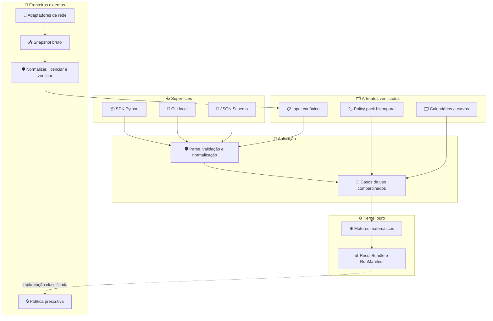

# Financial Planning SDK Brasil: estudo fundacional para um motor open source de estado da arte

_Revisão científica, atuarial, regulatória e de software · 8 de agosto de 2026_

---

## 📋 Resumo executivo

### Conclusão principal

É viável criar um SDK/CLI brasileiro de planejamento financeiro tecnicamente diferenciado, mas o caminho correto não é começar por um simulador Monte Carlo com uma única “probabilidade de sucesso”. O produto deve nascer como um **sistema de decisão auditável ao longo da vida**, no qual dinheiro, tempo, mortalidade, renda, metas, tributos, custos, seguros e preferências têm semântica explícita.

A principal referência organizadora encontrada é a abordagem multinível de Idzorek e Kaplan para o CFA Institute: primeiro resolve-se o problema econômico familiar ao longo do ciclo de vida; depois a alocação e a localização entre contas; por fim, a implementação em instrumentos. Os níveis podem operar separadamente, mas precisam compartilhar premissas e ser reconciliados periodicamente.[^1] Ela não é prova de superioridade do projeto. A versão brasileira deve ampliar essa separação para incluir pacotes de política bitemporais, fontes de dados licenciadas e uma fronteira explícita entre **cálculo** e **prescrição**.

O estado da arte, neste projeto, deve ser uma propriedade demonstrável:

- cobertura matemática superior a calculadoras de meta isolada;
- métricas que expressem probabilidade, magnitude e duração de déficit;
- comparação contra baselines simples e implementações independentes;
- reprodução classificada como exata, por tolerância numérica, estatística ou dependente de solver;
- regras brasileiras com fonte, vigência e testes;
- revisão independente por especialistas;
- comportamento seguro quando faltarem dados ou uma regra estiver vencida.

Sem esses gates, “SOTA” é posicionamento. Com eles, pode tornar-se uma conclusão sustentada por benchmark.

### Produto recomendado

O primeiro produto deve ser uma única distribuição Python provisoriamente chamada `finplanbr`, com:

| Superfície | Função | Compromisso inicial |
| --- | --- | --- |
| **SDK Python** | composição de modelos e pesquisas | API tipada e estável apenas no núcleo |
| **CLI** | execução local e automação | somente JSON no MVP; saída JSON canônica |
| **JSON Schema** | interoperabilidade entre linguagens | contrato versionado e sem regra implícita |
| **Pacotes BR** | calendário, RGPS, tributos e previdência | fonte, tempo válido, tempo de conhecimento e status jurídico |
| **Adaptadores** | BCB, Tesouro, CVM, IBGE e outros | opcionais; fora do cálculo puro |

Não se recomenda iniciar por API web, aplicativo, microsserviços, IA generativa ou integração com contas reais. Essas superfícies ampliam privacidade, regulação, disponibilidade e custo antes de o núcleo ser validado.

### Decisões fundacionais

1. **Monólito modular antes de serviços** — menor superfície operacional e maior testabilidade.
2. **Inglês no código, português e inglês na documentação** — interoperabilidade global sem perder precisão brasileira.
3. **Cálculo puro e local-first** — nenhuma rede ou telemetria no núcleo.
4. **`Decimal` ou centavos inteiros para razão contábil; `float64` apenas dentro de álgebra e simulação** — conversões explícitas nas fronteiras.
5. **Real e nominal nunca implícitos** — toda grandeza carrega moeda, data-base, frequência e convenção.
6. **Regras bitemporais** — o cálculo exige data econômica, tempo válido, tempo de conhecimento e cadeia de eventos; ausência, contestação ou expiração falha de modo explícito.
7. **Múltiplas métricas** — nenhum relatório se resume a `success_probability`.
8. **Baselines antes de modelos sofisticados** — depósitos determinísticos, escadas de títulos, 1/N e regras de gasto simples devem ser difíceis de superar fora da amostra.
9. **Licença do código separada da licença dos dados** — MIT/Apache de um adaptador não libera B3, ANBIMA ou outra fonte.
10. **Apache-2.0 como recomendação, não decisão já tomada** — a concessão de patentes é útil para colaboração empresarial; a escolha requer aceite do mantenedor.

### O que não construir no primeiro ciclo

- recomendador individualizado de valores mobiliários;
- calculadora que prometa benefício do INSS;
- apurador ou declarador de imposto de renda;
- agregador Open Finance/Open Insurance sem parceiro habilitado e consentimento;
- “carteira ótima” baseada em média e covariância pontuais;
- política de investimento aprendida por _reinforcement learning_ em produção;
- chatbot que altere premissas silenciosamente;
- dataset derivado de B3 ou ANBIMA redistribuído pelo repositório.

## 🔍 Escopo, método e linguagem de evidência

### Natureza da revisão

Este estudo usa uma revisão de escopo rápida e estruturada, descrita no [protocolo de pesquisa](review-protocol.md). Foram consultados OpenAlex, Crossref, literatura acadêmica e atuarial, monografias institucionais, repositórios originais e fontes oficiais brasileiras. O [ledger de evidências](evidence-ledger.csv) registra autoridade, contribuição, transferibilidade e limitação de cada fonte.

Não foi realizada meta-análise, dupla triagem ou validação empírica de benefício ao usuário. Desde a redação inicial deste estudo surgiu um motor local estreito de PV e ledger determinístico, descrito no ADR 0003; seus testes verificam o contrato computacional, não efetividade financeira no mundo real. A evidência disponível continua insuficiente para alegar benefício ao usuário.

Antes de qualquer desenvolvimento, três revisores-agent independentes — matemática/atuarial, regulação brasileira/LGPD/licenças e software open source/QA/segurança — executaram crítica adversarial e pré-mortem. O [parecer consolidado](../reviews/adversarial-review-2026-08-08.md) autorizou apenas a constituição F0 e rejeitou implementação/release até correções de valuation, sobrevivência, contratos, bitemporalidade e deployment. As correções aceitas foram incorporadas a este estudo; revisão humana externa ainda é obrigatória.

### Quatro camadas que não podem ser misturadas

- **Evidência:** o que uma fonte científica, atuarial, legal ou técnica efetivamente sustenta.
- **Inferência:** tradução de evidência para requisito de arquitetura ou teste.
- **Hipótese:** ideia promissora ainda sem benchmark local, como otimização distribucionalmente robusta.
- **Decisão:** escolha de produto, licença ou API que precisa ser aceita e governada pelo projeto.

Essa separação é especialmente importante porque “ótimo” tem significados distintos. Em um paper, pode ser a solução de um problema sob hipóteses fortes; em software, pode significar apenas que um solver convergiu; para uma família, pode não ser aceitável nem explicável.

### O status de “NERI”

A sigla `NERI` não foi encontrada como conceito técnico consolidado nas fontes pesquisadas. O material brasileiro consultado usa **renda necessária**, **necessidade de renda complementar** e **capital necessário** no processo de aposentadoria.[^2] A busca também sofre ruído por nomes próprios.

O projeto deve, portanto:

- modelar o conceito neutro `retirement_income_gap` dentro de `needs`;
- manter `NERI` fora da API pública até existir definição verificável;
- aceitar posteriormente um alias editorial, com glossário e decisão registrada;
- não inventar uma expansão da sigla e apresentá-la como referência brasileira.

### Critério de transferência para o Brasil

Um modelo internacional só deve entrar no núcleo depois de responder:

1. Quais variáveis e preferências são estruturais?
2. Quais parâmetros precisam de dados brasileiros?
3. Quais instituições do país de origem estão embutidas?
4. Como inflação, indexação, tributos, previdência e liquidez mudam o resultado?
5. Existe um caso reduzido com solução analítica, enumeração ou comparador independente?
6. O resultado é descritivo, comparativo ou prescritivo?

## 📚 Fundamentos científicos e atuariais

### O problema econômico correto

O planejamento ao longo da vida é um problema dinâmico sob incerteza. Os trabalhos fundacionais de Samuelson e Merton tratam escolha intertemporal de consumo e portfólio; extensões incorporam renda laboral não negociável, flexibilidade de trabalho e evolução das decisões por idade.[^3][^4][^5][^6] A literatura de _household finance_ mostra por que o domicílio real não se reduz a uma carteira: há restrições de liquidez, erros de decisão, produtos complexos, renda incompleta e ativos não financeiros.[^7]

A decomposição econômica mínima, somente dentro de um mesmo contexto de avaliação, é:

$$
N_t^{(v)} = F_t^{(v)} + H_t^{(v)} + S_t^{(v)} - L_t^{(v)}
$$

onde $F_t$ é riqueza financeira líquida, $H_t$ é capital humano, $S_t$ são benefícios e recursos futuros não incluídos em $H_t$, $L_t$ são passivos e compromissos, e $(v)$ identifica o mesmo `ValuationContext`: data, moeda, base real/nominal, finalidade, sobrevivência e um `valuation_operator` coerente. Para preço, o operador exige a dupla medida–numéraire ou um kernel de preços de estado relativo a uma medida; para melhor estimativa, exige medida de projeção e regra de desconto declaradas. A identidade é linear e aditiva: equivalente certo é calculado sobre o resultado familiar consolidado, não pela soma de equivalentes certos de componentes. Valor de mercado, melhor estimativa e equivalente certo são saídas diferentes. O portfólio financeiro só é uma parte de $F_t$; otimizar essa parte sem $H_t$, $S_t$ e $L_t$ pode aumentar o risco total da família.

Cada estoque e fluxo deve apontar para um `EconomicClaim` único. Essa proveniência impede que salário apareça simultaneamente como capital humano e caixa, que benefício apareça em $S_t$ e numa conta, ou que dividendo seja somado a um retorno total que já o contém.

A monografia anterior do CFA Institute conecta explicitamente capital humano, capital financeiro, seguro de vida e anuidades.[^57] Ela reforça a integração do problema, mas seus produtos, preços e instituições não podem ser importados como calibração brasileira.

O capital humano não deve ser tratado como “título prefixado”. Renda do trabalho é incerta, correlacionada com setores, inflação, saúde, desemprego e decisões de participação laboral. A literatura de ciclo de vida sustenta modelá-la como ativo não negociável e arriscado.[^5][^6]

### Consumo, liquidez e reserva de emergência

Modelos de poupança precaucionária explicam por que restrição de liquidez e incerteza de renda geram uma reserva mesmo quando uma regra média de consumo sugeriria investir tudo.[^8] Isso implica três caixas distintas:

- **liquidez operacional** — despesas previstas e irregularidades de curto prazo;
- **reserva de contingência** — choques de renda, saúde e manutenção;
- **capital de longo prazo** — metas cujo horizonte permite risco de mercado.

O tamanho da reserva não deve ser um múltiplo universal de despesas. O motor deve considerar estabilidade e concentração de renda, número de provedores, cobertura de seguros, liquidez dos ativos, despesas essenciais e tempo de reposição de renda. Uma regra simples continua sendo baseline; a personalização precisa mostrar quais fatores alteraram o resultado.

### Metas sem fragmentar a família

_Goals-based investing_ e contas mentais ajudam a representar pisos, metas e aspirações em termos compreensíveis. A literatura formaliza portfólios associados à probabilidade de cruzar um limiar de riqueza, e frameworks profissionais separam segurança, mercado e aspiração.[^9][^10]

Mas criar uma carteira independente por meta pode esconder correlações e competição por recursos. O projeto deve oferecer duas visões simultâneas:

- **contas de decisão** por meta, úteis para comunicação e restrições;
- **balanço agregado** da família, que impede dupla contagem e verifica consistência global.

As metas precisam de prioridade, flexibilidade de data e valor, indexador, moeda, natureza essencial/discricionária, possibilidade de financiamento e comportamento em caso de déficit. Uma meta não é apenas `amount + date`.

### Mortalidade, sobrevivência e seguros

Uma aposentadoria não tem horizonte fixo conhecido. Yaari estabeleceu a conexão entre vida incerta, consumo, seguro de vida e anuidades.[^11] Modelos modernos de mortalidade, como Lee-Carter e famílias estocásticas de dois fatores, permitem representar tendência e incerteza paramétrica.[^12][^13]

Para o Brasil, a primeira versão deve partir de tábuas oficiais do IBGE e distinguir:

- tábua de período e tábua de coorte;
- pessoa individual e sobrevivência conjunta de casal;
- mortalidade média populacional e ajustes que o produto não tem autoridade para inferir;
- risco sistemático de melhora de longevidade e variação idiossincrática;
- data de publicação, ano-base e revisão metodológica.

A tábua nacional é baseline, não previsão individual. O IBGE publica tábuas anuais e projeções revisadas; o material metodológico informa dados de censos, registros de óbitos e projeções até 2070 na revisão de 2024.[^14] A consequência de software é versionar o arquivo, a transformação e o modelo derivado.

O motor de seguros deve calcular **exposição econômica**, não selecionar produto. Para cada evento — morte, incapacidade, longevidade e perda de renda — compara-se o valor presente dos recursos após o evento com as obrigações protegidas. Cotação, subscrição, exclusões e adequação comercial ficam fora do núcleo.

### Renda na aposentadoria e desacumulação

O relatório atuarial da Society of Actuaries recomenda avaliar estratégias com um conjunto de resultados: renda esperada e percentis, probabilidade e magnitude de déficit, anos de déficit, exaustão de contas, renda mínima, utilidade e legado.[^15] É uma síntese cross-jurisdictional com exemplos australianos e norte-americanos, não norma nem calibração brasileira. Ainda assim, corrige um vício comum: dois planos podem ter a mesma probabilidade de falha e déficits economicamente muito diferentes.

O motor deve implementar e comparar ao menos:

1. gasto real fixo;
2. percentual fixo da riqueza;
3. regra de guardrails;
4. recálculo atuarial do valor remanescente;
5. piso essencial coberto por renda garantida e ativos casados;
6. política de piso, meta e gasto discricionário;
7. escada de fluxos reais com ativos indexados à inflação;
8. política dinâmica otimizada, somente em módulo experimental.

Uma anuidade atuarialmente justa, inclusive conjunta/reversível, deve ser benchmark de pooling de longevidade. Ela não equivale a cotação comercial: despesas, seleção, garantias, crédito, tributação e desenho do produto precisam de dados e policy pack próprios.

Regras dinâmicas que recalculam gasto conforme riqueza, retornos e horizonte são melhores benchmarks do que uma taxa fixa universal.[^16] Um trabalho de 2025 propõe outra composição de ativos reais seguros e risco de mercado; para o Brasil, a analogia com Tesouro IPCA+ é uma hipótese interessante, não uma transferência pronta, devido a tributação, spread, marcação a mercado, reinvestimento e desenho dos títulos.[^17]

### Preferências e utilidade

Utilidade é útil para comparar trajetórias de consumo, mas não é “a preferência verdadeira do usuário”. CRRA, aversão à perda, piso de consumo, legado e Epstein-Zin produzem políticas diferentes.[^18] Os parâmetros são difíceis de elicitar e devem ser exibidos em linguagem econômica.

Recomendação:

- métricas de shortfall são o relatório primário;
- utilidade é uma lente secundária;
- nenhuma otimização aceita parâmetros implícitos;
- toda preferência recebe análise de sensibilidade;
- o CLI fornece perfis de demonstração, nunca rótulos psicológicos apresentados como diagnóstico.

### Otimização robusta e multiperíodo

Média-variância é instável quando estimativas mudam; críticas clássicas e comparações fora da amostra justificam baselines simples, shrinkage e regularização.[^19][^20] Black-Litterman pode combinar equilíbrio e visões, mas não elimina o problema de qualidade dos inputs.[^21]

Otimização multiperíodo por horizonte móvel permite incluir custos, limites e previsões em cada replanejamento.[^22] Otimização distribucionalmente robusta pode proteger contra erro de distribuição, mas a escolha do conjunto de ambiguidade é outro parâmetro de modelo e deve permanecer experimental até ter validação local.[^23]

Uma hierarquia prudente é:

- regras fechadas e soluções analíticas;
- otimização convexa de período único;
- otimização robusta de período único;
- controle por horizonte móvel;
- programação dinâmica aproximada;
- política aprendida por ML/RL, somente para pesquisa adversarial.

Complexidade só avança se superar o nível anterior em utilidade fora da amostra, estabilidade, explicabilidade, tempo e segurança.

### Mapa científico por motor

| Motor | Âncora científica | Transferência brasileira | Gate antes de promoção |
| --- | --- | --- | --- |
| valuation/balanço | CFA 2024/2007; household finance | moedas, indexadores, tributos e benefícios separados | bases/claims reconciliados e revisão econômica |
| capital humano | Bodie–Merton–Samuelson; Viceira; Cocco et al. | emprego formal/autônomo, desemprego, saúde e RGPS | calibração local e stress de correlação |
| liquidez/emergência | Carroll e buffer-stock | informalidade, concentração de renda e acesso a crédito | baseline simples, estados laborais e iliquidez |
| necessidades/metas | CFA multilevel; TOP; mental accounts | pisos, metas, financiamento e sucessão | sem `NERI` inventado; vetores determinísticos |
| mortalidade/casal | Yaari; Lee–Carter; Cairns–Blake–Dowd | tábuas/projeções IBGE e estados familiares | convenção subanual e revisão atuarial |
| anuidades/seguros | Yaari; CFA 2007 | desenho SUSEP, tributação, elegibilidade e cotações separadas | valor atuarial ≠ preço; evento/claim reconciliado |
| desacumulação | SOA; Waring–Siegel; Sharkansky | IPCA+, spreads, imposto e produtos locais | múltiplas métricas, longevity benchmark e stresses |
| cenários | séries temporais/atuária/econometria | inflação, curva, câmbio, renda e regimes locais | point-in-time, holdout, dependência e convergência |
| portfólio | Michaud; 1/N; Black–Litterman; Boyd; DRO | custos, liquidez, lotes e capital humano | baselines, não-antecipatividade e estabilidade |
| regras BR | autoridades primárias e exemplos oficiais | RGPS, IRPF e previdência por domínio | bitemporalidade, counsel, expiry e fail-closed |

O ledger registra fontes; esta matriz não declara consenso nem eficácia. Cada motor mantém seu próprio model card, owner, challenger e domínio proibido.

## 🌐 Tradução para o Brasil

### Convenções financeiras são domínio, não detalhe

O Brasil exige representação explícita de:

- `business/252`, dias corridos e outras bases de contagem;
- capitalização simples, composta, contínua e frequências contratuais;
- taxas nominais, efetivas, reais e indexadas;
- calendários bancários, de bolsa e municipais distintos;
- IPCA, IGP-M, CDI/Selic e moedas como grandezas, não strings decorativas;
- datas de cotização, liquidação, carência, vencimento e fluxo;
- arredondamento legal/contratual separado do arredondamento numérico.

Os projetos `python-bizdays`, `python-fixedincome` e `R-fixedincome` de Wilson Freitas são referências úteis para calendários, taxas, curvas e testes diferenciais.[^24][^25][^26] O novo projeto, porém, deve publicar seu próprio contrato de semântica e vetores oficiais. Dependência não transfere responsabilidade pelo resultado.

### Previdência social

O RGPS contém regras gerais, transições, históricos contributivos, pisos, tetos e situações especiais. Em 2026, requisitos de idade e pontos das transições mudaram novamente; o próprio INSS avisa que sua simulação é apenas referência e não garante direito ao benefício.[^27]

Portanto, `br.inss` deve ser:

- pacote opcional e datado;
- calculador de cenários, não certificador de direito;
- baseado em eventos contributivos, não apenas salário atual;
- testado contra exemplos oficiais e casos de fronteira;
- capaz de responder `indeterminate` quando faltarem vínculos ou regra aplicável;
- acompanhado de fonte normativa e data de verificação.

Uma integração com Meu INSS não deve ser presumida. Importação de extrato fornecido pelo próprio usuário é problema separado, com esquema, privacidade e validação documental.

### Previdência complementar, PGBL e VGBL

Previdência aberta e fechada precisam de modelos de contribuição, carregamento, taxa de administração, fundo subjacente, carência, portabilidade, fase de benefício, reversão e tributação. PGBL e VGBL diferem na dedutibilidade e na base tributável do benefício; a Receita Federal descreve a dedução do PGBL dentro das condições aplicáveis e a tributação do VGBL sobre rendimento.[^28]

A Lei 14.803/2024 alterou o momento de escolha do regime tributário, permitindo a opção até o benefício ou primeiro resgate nos casos abrangidos.[^29] A consequência é decisiva: uma tabela fixa no código fica obsoleta. O modelo deve representar lotes de aporte, tempo de acumulação, regime, data da opção e fonte legal.

Não é seguro produzir “PGBL sempre é melhor para quem faz declaração completa”. O cálculo depende de renda tributável, contribuições oficiais, deduções, horizonte, taxas, regime, estratégia de retirada e mudanças futuras. O motor pode comparar cenários; não deve converter uma heurística em verdade.

### Tributação

As tabelas de IRPF e de rendimentos de capital mudam com o tempo; a Receita mantém páginas por ano e vigência.[^30] O desenho recomendado é um _policy pack_ declarativo:

```text
policy_id: br.federal.irpf.example
jurisdiction: BR
legal_status: in_force
legal_certainty: final
valid_effect_from: 2026-01-01
valid_effect_until: null
known_from: 2025-12-31T12:00:00-03:00
known_until: null
authority_refs: [br.authority.example]
legal_event_chain: [br.event.example]
source_checksum: sha256:...
reviewer: null
review_expires_at: null
parameters: {...}
authority_tests: [...]
```

Datas `effective_from/effective_until` isoladas não bastam: suspensão, restauração, decisão cautelar, retroatividade e conhecimento tardio exigem eventos normativos separados. O caso IOF/VGBL de 2025 — inclusive a diferença entre restauração declarada `ex tunc` e esclarecimento posterior sobre o período suspenso — é o teste adversarial obrigatório. O esquema completo e seus reason codes estão em [policy-packs.md](../specification/policy-packs.md), com eventos iniciais no [ledger jurídico](../governance/legal-event-ledger.csv). O motor tributário deve distinguir cálculo estimativo, cálculo por evento e apuração fiscal. O MVP só oferece estimativa com escopo declarado. Apuração oficial, declaração, ganho de capital complexo, sucessão estadual e residência fiscal exigem módulos e revisão próprios.

### Dados oficiais e dados licenciados

O ecossistema brasileiro não é uma única “API financeira”.

| Fonte | Dados úteis | Política proposta |
| --- | --- | --- |
| **BCB** | SGS, PTAX, Focus/OData | adaptador oficial ou `python-bcb`; licença verificada por recurso, sem generalizar a ODbL do Focus[^31] |
| **Tesouro** | preços e taxas de títulos | snapshot diário com metadados e ODbL[^32] |
| **CVM** | cadastro, informe diário e carteiras de fundos | dataset por dataset; reapresentações preservadas[^33] |
| **IBGE** | mortalidade, população e inflação | snapshot e metodologia versionados[^14] |
| **INSS** | regras e simulador oficial | autoridade para testes; sem promessa de benefício[^27] |
| **SUSEP/PREVIC** | produtos e estatísticas previdenciárias | dados públicos separados de dados pessoais[^34] |
| **Open Finance** | contas, crédito e investimentos consentidos | pacote externo com participante autorizado[^35] |
| **Open Insurance** | seguro e previdência consentidos | pacote externo; consentimento e credenciamento[^36] |
| **B3** | negociação, índices e posições | licença contratual; não redistribuir por padrão[^37] |
| **ANBIMA** | calendário, curvas, índices e REUNE | verificar termos por produto; REUNE restringe distribuição[^38] |

`brasa` demonstra uma arquitetura útil de ingestão com camada bruta, Parquet, metadados, status e CLI sobre fontes brasileiras.[^39] Isso é inspiração para um pacote `finplanbr-data`, não razão para acoplar download ao núcleo.

Todo snapshot deve registrar `source`, licença do recurso e versão do texto, titular, `retrieved_at`, `observed_at`, `effective_at`, `checksum`, revisão, transformação, direitos de redistribuição/derivação e flags de qualidade. `observed_at` e `effective_at` não são intercambiáveis. ODbL pode exigir aviso, atribuição, share-alike e oferta da base derivada em formato legível por máquina; `adapter-only` reduz risco, mas não resolve automaticamente a licença. O [manifesto de licenças](../../DATA_LICENSES.md) é fail-closed.

### Fronteira regulatória

A Resolução CVM 19 define consultoria de valores mobiliários como orientação, recomendação ou aconselhamento profissional, independente e individualizado, e distingue planejadores cuja atuação não envolva essa atividade.[^40] A Resolução CVM 30 disciplina adequação de produtos, serviços e operações ao perfil do cliente.[^41]

Isso não significa que uma biblioteca open source seja automaticamente consultoria. Significa que a **implantação, o fluxo, a personalização e a saída** importam. Os verbos técnicos não são safe harbors; a arquitetura deve separar:

- `compute` — calcula cenários, métricas e decomposições;
- `compare` — compara alternativas fornecidas sob premissas explícitas;
- `explain` — mostra atribuição sob o modelo, sensibilidade e limitações;
- `recommend` — política prescritiva externa, desabilitada no projeto-base;
- `execute` — contratação ou ordem, totalmente fora do núcleo.

Uma comparação que gera alternativas, ranqueia uma “melhor”, usa classes/valores mobiliários ou conduz à contratação pode materialmente orientar o cliente. Algoritmos automatizados permanecem sujeitos às obrigações aplicáveis. Um disclaimer não cura uma atividade regulada. Antes de disponibilizar recomendação individualizada, uma implantação precisa de análise jurídica atual, governança de suitability, conflitos, registros e responsabilidades. A [classificação de implantação](../governance/deployment-classification.md) define os gates A–D; o projeto-base habilita apenas pesquisa/cálculo não prescritivo.

### Privacidade e consentimento

Dados financeiros, familiares, de saúde, renda e objetivos formam um perfil de alta sensibilidade econômica. A LGPD exige governança conforme o papel e a finalidade da implantação.[^42] O núcleo deve minimizar risco por desenho:

- funcionamento offline;
- nenhum dado pessoal em telemetria;
- exemplos sintéticos;
- criptografia e armazenamento sob responsabilidade da aplicação hospedeira;
- campos opcionais e minimização;
- exportação e exclusão condicionadas à finalidade e a deveres de retenção aplicáveis;
- redaction em logs e erros;
- conectores consentidos fora do processo matemático.

`Local-first` reduz superfície, mas não define controlador, operador, base legal, finalidade, retenção, atendimento de direitos ou revisão de decisão automatizada. Esses papéis variam por implantação e estão delimitados em [PRIVACY.md](../../PRIVACY.md). No Open Finance, compartilhamento requer consentimento, autenticação e confirmação por participantes; no Open Insurance, dados pessoais dependem de consentimento e participação autorizada ou credenciada.[^35][^36] O repositório pode oferecer modelos e clientes gerados, mas não atalhos para credenciais, scraping de portais ou simulação de participação regulada.

### Disclaimers, open source e finalidade educacional

Finalidade educacional, licença open source e execução local são características reais do projeto, mas não são imunidades. O enquadramento segue a função e o uso concreto; a LGPD segue o tratamento realizado; e a licença dos dados segue cada recurso e artefato derivado. Por isso o pacote documental separa:

- [DISCLAIMER.md](../../DISCLAIMER.md) — finalidade, ausência de aconselhamento e limites de confiança;
- [PRIVACY.md](../../PRIVACY.md) — estado atual sem PII e obrigações por implantação futura;
- [MODEL_RISK.md](../../MODEL_RISK.md) — hipóteses, validade, incerteza e usos proibidos;
- [DATA_LICENSES.md](../../DATA_LICENSES.md) — código, dados, snapshots e redistribuição.

Esses documentos melhoram transparência, expectativa e governança; não substituem licença de software, consentimento/base legal, parecer jurídico, autorização profissional, suitability ou revisão de policy pack. Exemplos são sintéticos e toda aplicação real deve classificar seu deployment antes de habilitar comparação personalizada.

## 🔗 Ecossistema open source e estratégia de composição

### Referências brasileiras de Wilson Freitas

Os repositórios pesquisados não formam um planejador financeiro completo, mas oferecem peças e padrões relevantes:

| Projeto | Decisão | Motivo |
| --- | --- | --- |
| `brasa` | adaptar opcionalmente | ingestão brasileira reprodutível e metadados[^39] |
| `python-bcb` | adaptar opcionalmente por endpoint | cliente BCB abrangente e async; o módulo de moeda documenta scraping, portanto não é contrato uniforme[^43] |
| `python-bizdays` | candidato a dependência | calendário e `business/252`[^24] |
| `python-fixedincome` | benchmark primeiro | API compacta, mas ainda alpha e com metadados prototípicos[^25] |
| `R-fixedincome` | comparador diferencial | curvas, taxas e convenções em implementação independente[^26] |
| `salim` | apenas arqueologia | orçamento/OFX antigo, sem licença detectada e inativo[^44] |

A regra é **compor por contrato, não por proximidade de autor**. Cada projeto deve passar por avaliação de licença, maturidade, precisão, estabilidade e custo de manutenção.

### Projetos globais

| Projeto | Força | Uso proposto | Restrição principal |
| --- | --- | --- | --- |
| **HARK** | consumo/poupança e programação dinâmica | challenger de pesquisa | beta e maturidade desigual; não é planner[^45] |
| **skfolio** | pipeline de portfólio, CV e risco robusto | backend experimental | não cobre ciclo de vida[^46] |
| **PyPortfolioOpt** | baselines conhecidos | teste diferencial | foco em carteira[^47] |
| **Riskfolio-Lib** | grande catálogo de risco convexo | benchmark | superfície extensa[^48] |
| **cvxportfolio** | horizonte móvel e custos | estudar paper e comparar | GPL-3.0 no código[^49] |
| **QuantLib** | instrumentos, curvas e pricing | extra avançado/comparador | grande dependência; não é planner[^50] |
| **OpenFisca** | regras por vigência | inspiração arquitetural | AGPL-3.0; sem pacote local pronto[^51] |
| **PolicyEngine** | microssimulação explicável | inspiração e possíveis testes | AGPL-3.0 e países diferentes[^52] |
| **Wealthfolio** | UX local-first | referência de produto | AGPL-3.0 e foco em app[^53] |

### Quatro relações possíveis

Cada projeto externo recebe exatamente um papel por caso de uso:

1. **Dependência:** importado no runtime; exige licença compatível e SLA de manutenção.
2. **Adaptador:** integração opcional por protocolo; falha não derruba o núcleo.
3. **Comparador:** executado em testes diferenciais, sem integrar o pacote distribuído; não é verdade de referência.
4. **Inspiração:** ideia ou arquitetura reimplementada a partir de fonte permitida e documentada.

Essa taxonomia evita duas falhas: reescrever tudo sem necessidade e montar um núcleo impossível de auditar por excesso de dependências. Oráculos ficam restritos a soluções fechadas, enumeração exaustiva, identidades contábeis e exemplos oficiais dentro do escopo exato. Repositórios móveis entram no [manifesto de comparadores](software-comparator-manifest.csv) com versão/tag, commit, SPDX e ambiente observado; enquanto `immutable_ref=UNPINNED`, nenhum benchmark está pronto para release.

### Política de licença

A recomendação inicial é Apache-2.0 para código novo, com:

- `NOTICE` quando necessário;
- inventário SPDX de dependências;
- atribuição de dados separada;
- proibição de incluir snapshots sem licença compatível;
- revisão jurídica para copyleft forte e integrações comerciais;
- `REUSE.toml` ou cabeçalhos SPDX apenas quando a política for aceita.

Não se deve criar `LICENSE` antes da decisão do mantenedor. GPL/AGPL não são “licenças ruins”; apenas mudam as obrigações e a estratégia de distribuição. O risco é tratar compatibilidade como detalhe posterior.

## ⚙️ Produto, arquitetura e contratos

### Arquitetura lógica



O diagrama mostra um **monólito modular**. Não há servidor obrigatório nem banco central. O aplicativo hospedeiro decide persistência, autenticação e interface. `compute` nunca recebe cliente HTTP: recebe apenas artefatos resolvidos, verificados e imutáveis. SDK e CLI chamam os mesmos casos de uso, evitando duas semânticas.

### Módulos propostos

```text
finplanbr/
  domain/              # pessoas, domicílio, contas, metas, eventos
  money/               # moeda, centavos, arredondamento
  temporal/            # datas, períodos, calendários, day count
  rates/               # taxas, fatores, curvas e indexadores
  cashflows/           # fluxos determinísticos e condicionais
  balance_sheet/       # medidas coerentes de F + H + S - L
  needs/               # piso, meta, renda complementar, capital necessário
  mortality/           # tábuas, sobrevivência individual e conjunta
  human_capital/       # renda laboral, transições e choques
  goals/               # prioridades, flexibilidade e funding
  insurance/           # gaps econômicos por evento
  accumulation/        # contribuições, contas e custos
  decumulation/        # regras de renda e legado
  scenarios/           # estados econômicos e geradores
  metrics/             # shortfall, renda, legado, utilidade
  optimization/        # backends convexos e robustos opcionais
  reporting/           # explicações e decomposições
  br/
    calendars/
    tax/
    inss/
    pension/
  data_contracts/      # contratos de artefatos, sem download implícito
  experimental/        # APIs instáveis e não prescritivas
```

### Modelo de domínio mínimo

As entidades centrais são:

- `Household` — pessoas, relacionamentos, dependência econômica e moeda-base;
- `Person` — nascimento, horizonte, renda, aposentadoria e hipóteses de sobrevivência;
- `Account` — titularidade, regime tributário, liquidez, custos e lotes;
- `AssetPosition` — instrumento, quantidade, custo, valor e restrições;
- `Liability` — fluxo, prioridade, indexador, contingência e colateral;
- `IncomeStream` — trabalho, benefício, aluguel, pensão ou anuidade;
- `EconomicClaim` — identidade econômica que impede dupla contagem entre estoque, fluxo e transferência;
- `Goal` — piso/meta, valor, data, flexibilidade, prioridade e estado de falha;
- `ValuationContext` — data, moeda, base de preços, operador coerente (medida–numéraire, kernel ou projeção–desconto), finalidade e sobrevivência;
- `PolicyContext` — jurisdição, tempo válido, tempo de conhecimento e cadeia normativa;
- `RegulatoryUseContext` — classe de implantação, personalização, instrumento, ranking, reviewer e autorização;
- `GovernanceEnvelope` — disclaimer imutável, risco de modelo, classe de implantação, usos, warnings e contexto regulatório inseparáveis do resultado;
- `AssumptionSet` — premissas econômicas, mortalidade, preferências e fontes;
- `Plan` — alternativas controláveis, nunca texto de recomendação;
- `RunManifest` — identidade completa de uma execução;
- `ResultBundle` — métricas, distribuições, atribuições, alertas e estados de computação/modelo/uso.

Campos financeiros devem usar unidade explícita. `0.12` não é taxa suficiente: pode ser 12% nominal ao ano, efetiva ao ano, real, líquida ou mensal. O tipo de taxa carrega convenção, base e período.

### Contrato de entrada

O núcleo deve rejeitar entrada ambígua. Um exemplo conceitual:

```json
{
  "schema_version": "0.1.0",
  "synthetic": true,
  "base_currency": "BRL",
  "valuation_context": {
    "valuation_date": "2026-08-08",
    "information_set_id": "info-synthetic-2026-08-08",
    "valuation_operator": {
      "kind": "best_estimate",
      "projection_measure_id": "p-household-synthetic-v1",
      "discount_rule_id": "br-real-curve-snapshot-v1"
    }
  },
  "policy_context": {
    "jurisdiction": "BR",
    "valid_at": "2026-08-08",
    "known_at": "2026-08-08T12:00:00-03:00"
  },
  "data_context": {
    "observed_through": "2026-08-07",
    "snapshot_ids": ["synthetic-market-snapshot-v1"]
  },
  "governance_envelope": {
    "artifact_status": "draft",
    "disclaimer_id": "financial-planning-sdk-br-disclaimer",
    "disclaimer_version": "2026-08-08",
    "disclaimer_hash": "sha256:REQUIRED_AT_BUILD",
    "model_risk_policy_id": "model-risk-2026-08-08",
    "declared_deployment_class": "A_RESEARCH_CORE",
    "derived_minimum_deployment_class": "A_RESEARCH_CORE",
    "effective_deployment_class": "A_RESEARCH_CORE",
    "intended_use": ["education", "scientific_evaluation"],
    "prohibited_uses": ["personalized_recommendation", "order_execution"],
    "warnings": ["BLUEPRINT_NOT_APPROVED"],
    "regulatory_use_context": {
      "declared_deployment_class": "A_RESEARCH_CORE",
      "operator_legal_entity": "not_applicable",
      "operator_jurisdiction": "BR",
      "authorization_type": "not_applicable",
      "authorization_registry_id": "not_applicable",
      "client_specific": false,
      "instrument_scope": "cashflow_only",
      "alternatives_origin": "user_supplied",
      "ranking_enabled": false,
      "recommendation_language_enabled": false,
      "execution_enabled": false,
      "compensation_model": "not_applicable",
      "conflict_policy_id": "not_applicable",
      "suitability_record_id": "not_applicable",
      "human_reviewer_id": "not_applicable",
      "counsel_opinion_id": "not_applicable",
      "retention_policy_id": "not_applicable"
    }
  },
  "household": {
    "people": [
      {
        "id": "primary",
        "birth_date": "1986-04-10",
        "mortality_model": "ibge_2024_period_male"
      }
    ]
  },
  "goals": [
    {
      "id": "retirement_floor",
      "kind": "essential_income_floor",
      "amount": {
        "value": "8000.00",
        "currency": "BRL",
        "price_basis": "real",
        "base_date": "2026-08-08"
      },
      "starts_at": "2051-04-01",
      "priority": "essential"
    }
  ],
  "assumptions": {
    "inflation_model": "deterministic_ipca",
    "real_discount_curve": "br_ipca_zero_2026_08_08"
  }
}
```

O valor monetário é string para preservar decimal no JSON. A validação deve exigir identificadores estáveis, proibir datas impossíveis, detectar dupla contagem de renda e sinalizar curvas incompatíveis.

### Contrato de saída e explicabilidade

Todo resultado deve incluir:

- `governance_envelope` com `artifact_status`, `disclaimer_id`, `disclaimer_version`, `disclaimer_hash`, `model_risk_policy_id`, classes declarada/mínima derivada/efetiva, `intended_use`, `prohibited_uses`, `regulatory_use_context` completo e warnings;
- `computational_status`: `computed`, `computed_with_warnings`, `indeterminate` ou `rejected`;
- `model_validity`, `policy_authority_status` e `deployment_eligibility` separados;
- métricas com unidade, horizonte e condicionamento;
- decomposição de recursos e necessidades;
- cenários e pesos usados;
- intervalo numérico ou erro amostral quando aplicável;
- restrições ativas e variáveis de decisão;
- sensibilidade às premissas materiais;
- alertas de dados vencidos ou regra incompleta;
- manifesto com seed, solver, versões e checksums;
- linguagem que distingue cálculo, comparação e recomendação.

SDK, CLI e reporting compartilham o [catálogo de estados e reason codes](../specification/error-catalog.md); mensagem localizada não é contrato e nunca repete PII do input.

Explicação não deve ser texto gerado depois do fato. O motor produz um `AttributionGraph`: sob as equações e o contrafactual declarados, uma mudança de contribuição altera saldo, cobertura e déficit. Isso é atribuição/sensibilidade dependente do modelo, não inferência causal sobre o mundo. Uma camada de linguagem pode verbalizar o grafo, mas não elevar fator a causa.

### CLI proposta

| Superfície conceitual | Primeiro marco possível | Estado/perímetro |
| --- | --- | --- |
| `finplanbr validate input.json` | `0.0.x` | valida contrato; não calcula nem presume classe A |
| `finplanbr manifest verify result.json` | `0.0.x` | verifica envelope/fingerprints offline |
| `finplanbr compute needs input.json --output result.json` | `0.1` | apenas pesquisa descritiva autorizada pelo envelope |
| `finplanbr policy list --jurisdiction BR --valid-at ... --known-at ...` | `0.2` | metadados de artefatos aprovados; draft não é executável |
| `finplanbr explain result.json --locale pt-BR` | `0.1` | verbaliza atribuição; não cria recomendação |
| `finplanbr simulate retirement input.json --seed 20260808` | `0.4 experimental` | somente model card/holdout aprovados |
| `finplanbr compare plans ...` | não aprovado no projeto-base | depende de classe mínima derivada e perímetro/counsel |
| `finplanbr optimize ...` | não aprovado no projeto-base | bloqueado em A; não faz parte da API aceita |

Todo comando que aceita ou produz resultado material consome `GovernanceEnvelope` e `RegulatoryUseContext` selados no input/manifesto; ausência retorna `REGULATED_USE_UNDECLARED` e nunca recebe classe A por default. Todos os comandos de cálculo são offline. Comandos de dados devem usar um namespace separado, pedir fonte explicitamente e nunca sobrescrever snapshot silenciosamente.

### API pública e estabilidade

O SDK deve estabilizar primeiro:

- tipos de valor e tempo;
- schemas de entrada/saída;
- protocolos de curvas, mortalidade e políticas;
- métricas fundamentais;
- formato do manifesto.

Implementações numéricas e modelos avançados podem permanecer internos ou em `experimental`. A versão SemVer da API não basta: modelos, políticas e dados têm versões próprias.[^54]

## 📊 Especificação dos motores matemáticos

O contrato completo está em [mathematical-engine.md](../specification/mathematical-engine.md). Esta seção resume as decisões de maior impacto.

### Grandezas e precisão

O sistema terá três domínios numéricos:

1. **contábil:** `Decimal` ou centavos inteiros, com regra de arredondamento explícita;
2. **determinístico financeiro:** `Decimal` quando a precisão contratual for necessária, ou `float64` documentado para álgebra de curvas;
3. **numérico estocástico:** arrays `float64`, com conversão controlada e reconciliação monetária na saída.

Não se promete “precisão exata” em simulação. Promete-se rastreabilidade do erro, convergência, estabilidade e arredondamento correto onde existe obrigação discreta.

### Capital humano e passivos

Para avaliações lineares, uma aproximação discreta pathwise do capital humano é:

$$
H_{t_0}^{(v)}=\mathbb E_P\!\left[
\sum_{d\in\mathcal D_Y(t_0,r_Y)}
\mathbf 1_{alive,d}Y_d^{net}(z_d)M_{t_0,d}^{(v)}
\;\middle|\;\mathcal I_{t_0}\right]
$$

onde $Y_d^{net}(z_d)$ é renda líquida no estado conjunto, e $M^{(v)}$ vem do `valuation_operator`. Sobrevivência, participação, renda e kernel permanecem na mesma esperança. A fatoração $p_{t_0,d}E[Y_d]v_Y(t_0,d)$ só é válida sob independências condicionais demonstradas e quando nenhum termo já inclui sobrevivência; caso contrário, ela cria viés ou dupla ponderação. Valor esperado, valor replicável e equivalente certo são objetos diferentes, e o último é aplicado ao resultado consolidado.

Passivos essenciais podem ser avaliados por uma curva real ou nominal coerente com indexação. Metas flexíveis exigem cenários de data/valor, não um único PV.

### Necessidade de renda e capital

Para cada período:

$$
G_s = \max\left(0, C_s^{target} - I_s^{secure}\right)
$$

e a família de capitais/reservas depende do objetivo. `best_estimate_epv_capital`, reserva de auto-seguro em quantil, capital sob chance constraint, equivalente certo e prêmio de anuidade não são aliases. Cada objeto explicita $G_s$, curva ou kernel, sobrevivência, custos, tributos, valor terminal, condicionamento e model card. O cálculo deve expor:

- renda essencial, desejada e discricionária;
- fontes garantidas, condicionais e arriscadas;
- gap bruto e líquido de tributos;
- capital/EPV com e sem legado, identificado pelo método;
- contribuição exigida para o objetivo de funding explicitamente nomeado;
- sensibilidades a aposentadoria, inflação, retorno e longevidade.

O contrato fixa três datas distintas — avaliação $t_0$, aposentadoria $r$ e terminal $\omega$ — e leva recursos, contribuições, necessidade e reserva terminal à mesma data. Uma anuidade atuarialmente justa, com versões conjunta e reversível, é benchmark de pooling de longevidade; não é cotação de produto nem recomendação.

### Cenários coerentes

O vetor de estado pode incluir inflação, taxa real, curva nominal, prêmio de ações, câmbio, renda laboral, desemprego e despesas extraordinárias. Gerar cada variável de forma independente é inválido quando suas correlações determinam o risco.

O sistema deve suportar:

- cenários determinísticos e históricos;
- _bootstrap_ em blocos;
- modelos paramétricos com regimes;
- cenários condicionados a curvas atuais;
- stresses narrativos reproduzíveis;
- ensembles com pesos explícitos.

GBM simples pode existir como fixture didática, não como distribuição padrão apresentada como realidade.

### Métricas mínimas

Para recursos $R_s$ e piso $B_s$, o déficit é $D_s=(B_s-R_s)^+$. As métricas mínimas incluem:

- probabilidade de algum déficit;
- `ExpectedDeficit` incondicional por período;
- `ConditionalMeanDeficit` dado déficit positivo;
- `TailExpectedShortfall` na cauda, com $\alpha$ e convenção de perda;
- déficit ponderado por sobrevivência;
- número esperado de períodos abaixo do piso;
- primeiro período de déficit;
- probabilidade de exaustão de conta;
- renda real por percentis;
- cobertura de piso e família de _funded ratios_ com base de avaliação nomeada;
- impostos, custos e turnover;
- legado por percentis;
- utilidade/consumption-equivalent como métrica secundária.

Relatar só $P(\text{saldo final}>0)$ destrói informação temporal e de severidade.

### Otimização

O problema geral escolhe contribuição, aposentadoria, gasto, seguro, alocação e localização sob restrições. Não deve ser resolvido de uma vez no início. A decomposição recomendada é:

1. fechar balanço, piso e restrições duras;
2. comparar decisões dominantes com regras simples;
3. otimizar alocação/localização sob premissas fixadas;
4. reintroduzir feedback multiperíodo;
5. executar sensibilidade e stress;
6. rejeitar solução que seja numericamente ótima e economicamente instável.

O solver retorna status, tolerâncias, resíduo, gap, restrições ativas e solução fallback. `optimal_inaccurate` nunca é traduzido para “plano ótimo”.

Toda decisão multiperíodo deve ser mensurável em relação ao conjunto de informação disponível na data da ação. Árvores de cenários impõem não-antecipatividade: histórias observavelmente iguais recebem a mesma decisão. Resultado com informação perfeita é apenas bound diagnóstico. Tributação por lotes e localização podem exigir MIP; o relatório inclui incumbent, best bound, `mip_gap` e garantia global/local.

### Replanejamento

Planejamento é um processo, não um PDF. Em cada data de revisão:

1. observa-se estado e mudanças familiares;
2. reconcilia-se patrimônio e premissas;
3. atualizam-se regras e dados válidos;
4. recalculam-se políticas futuras;
5. preservam-se decisões irreversíveis e custos;
6. explica-se a diferença contra o plano anterior.

O padrão técnico é controle por horizonte móvel, com trilha de auditoria. Periodicidade anual é baseline razoável; eventos como perda de renda, casamento, herança, mudança tributária ou grande variação patrimonial disparam revisão extraordinária.[^1]

## 🧪 Qualidade científica, engenharia e governança

### Pirâmide de validação

Um motor científico precisa de cinco tipos de validade:

| Camada | Pergunta | Evidência de aceitação |
| --- | --- | --- |
| **Conceitual** | o problema representa a decisão? | revisão por CFP/atuário/economista e ADR |
| **Matemática** | equações e unidades são corretas? | derivação, casos analíticos e invariantes |
| **Numérica** | a implementação resolve o modelo? | convergência, tolerâncias, casos fechados e comparadores |
| **Empírica** | premissas descrevem dados relevantes? | calibração, backtest e stress fora da amostra |
| **Operacional** | o usuário consegue interpretar e reproduzir? | schemas, manifestos, acessibilidade e testes de UX |

Uma camada não compensa ausência de outra. Dez mil testes unitários não corrigem um objetivo econômico errado.

### Estratégia de testes

- **Exemplos oficiais:** Receita, INSS, Tesouro, CVM e metodologias publicadas
- **Testes unitários:** fórmulas, datas, arredondamento e casos de fronteira
- **Propriedades:** monotonicidade, conservação, ausência de arbitragem e equivalência de taxas
- **Metamórficos:** mudar unidade ou data-base de forma equivalente preserva resultado econômico
- **Diferenciais:** `R-fixedincome`, QuantLib, HARK, PyPortfolioOpt e planilhas revisadas como comparadores, não oráculos
- **Estocásticos:** seed fixa mais tolerâncias estatísticas, nunca golden bit a bit como única defesa
- **Solvers:** factibilidade, KKT quando aplicável, dualidade, resíduos e fallback
- **Mutação:** fórmulas críticas precisam falhar quando operadores/sinais são alterados
- **Contratos de dados:** schema, checksum, revisão e comportamento com coluna nova/ausente
- **Plataformas:** Windows, Linux e macOS; versões Python suportadas
- **Adversariais:** inflação extrema, curva invertida, renda zero, morte precoce, vida longa, dados faltantes e metas impossíveis

### Reprodutibilidade

O `RunManifest` deve gravar sete fingerprints independentes:

- `software_artifact` — pacote, versão, commit e build;
- `contract_schema` — versão e hash do JSON Schema normativo;
- `model_specification` — equações, algoritmo e hash do model card;
- `calibration_parameters` — parâmetros, janela, transformação e hash;
- `policy_pack` — versão, tempo válido/conhecido, autoridade e hash;
- `data_snapshot` — recurso, revisão, licença e checksum;
- `runtime_fingerprint` — plataforma, dependências, RNG, solver, opções e paralelismo.

Avisos, exceções controladas e classe de reprodução também pertencem ao manifesto.

Seeds não garantem reprodução eterna entre algoritmos e versões. Cenários regulatórios ou exemplos de publicação devem poder ser armazenados como vetores explícitos.

### Compatibilidade em sete eixos

SemVer governa o artefato de software e sua API; os outros seis fingerprints não são comprimidos nele. Uma mudança em tabela do IRPF não exige versão major da API. Uma mudança no significado de `real_rate` exige. Resultados só são comparáveis quando os sete eixos e a classe de reprodução são conhecidos.

### Segurança e cadeia de suprimentos

O projeto deve evoluir para:

- dependências com hashes e atualização automatizada revisada;
- SBOM por release;
- assinatura de artefatos;
- proveniência de build alinhada a SLSA;[^55]
- `SECURITY.md` e canal privado de vulnerabilidade;
- análise estática, secret scanning e Scorecard;[^56]
- ambientes de documentação sem dados pessoais;
- fuzzing de parsers de OFX/CSV/JSON quando existirem;
- limites de memória/tempo para cenários e otimização.

### Governança científica

Papéis distintos devem aprovar mudanças distintas:

- mantenedor de engenharia — API, releases e compatibilidade;
- dono de modelo — equações, calibração e benchmark;
- revisor atuarial — mortalidade, renda e seguros;
- revisor CFP — coerência do processo de planejamento;
- revisor tributário/jurídico — pacote e escopo regulatório;
- steward de dados — licença, proveniência e revisão;
- segurança/privacidade — ameaça, consentimento e logs.

Cada modelo material precisa de um _model card_ contendo finalidade, equações, dados, população, hipóteses, validação, falhas conhecidas e uso proibido. Cada alteração científica passa por RFC/ADR e comparação reproduzível.

### Política para IA

LLMs podem ajudar a:

- explicar um grafo de atribuição já calculado, sem linguagem causal indevida;
- converter linguagem natural em rascunho de input para confirmação;
- localizar documentação;
- gerar casos de teste revisados.

Não podem:

- inventar premissas ausentes;
- selecionar produto financeiro no núcleo;
- alterar cálculo depois do manifesto;
- ser fonte de tabela legal;
- emitir número sem resultado estruturado;
- tornar output não determinístico por padrão.

Toda narrativa gerada deve citar os campos do `ResultBundle` dos quais deriva.

## 🎯 Roadmap, critérios de saída e riscos

### F0 — constituição antes do código

Entregáveis: decisão de licença, controle de versão, ADRs, glossário, threat model, classificação de implantação, convenções de valuation/sobrevivência, JSON Schema normativo, catálogo de erros e corpus inicial. Gate: correções P0/P1 reconciliadas, revisão matemática independente e nenhuma ambiguidade material em dinheiro, taxa, tempo, identidade econômica ou vigência.

### Release 0.0.x — contratos e corpus

Sem motor público. Publicar schemas Draft 2020-12, manifesto, reason codes, política de compatibilidade, model-card template e 20–30 vetores fechados. Gate: cada vetor material é reconciliado por duas derivações independentes, enumeração ou identidade reconhecida.

### Release 0.1 — núcleo determinístico

Somente JSON, sem rede: `money`, `temporal`, taxas/fatores, cash flows, curvas fornecidas pelo usuário, PV/FV, balanço coerente e necessidade determinística. SDK e CLI usam o mesmo caso de uso. Gate: invariantes, mutação, bytes canônicos nas grandezas exatas, sdist/wheel smoke tests e zero acesso de rede.

### Release 0.2 — primitivas brasileiras

Calendários versionados, `BUS/252`, indexadores e observações. Snapshots são produzidos por processo/pacote separado. Gate: licença por recurso, proveniência, assinatura/trust root, bitemporalidade, overlap/gap/expiry tests e CI Windows/Linux.

### Release 0.3 — ciclo de vida determinístico/research

Mortalidade individual e estados familiares, capital humano, renda necessária, regras simples de desacumulação, benchmark de anuidades e métricas de déficit sem dupla ponderação. Gate: revisão atuarial, convenções subanuais e comparadores independentes reconciliados.

### Release 0.4 — estocástico experimental

RNG/streams, cenários, convergência, incerteza amostral versus de parâmetro/modelo, stresses e challengers. Gate: holdout temporal congelado, protocolo pré-registrado e nenhuma política prescritiva padrão.

### Promoções independentes por domínio

RGPS, IRPF, PGBL/VGBL, seguros, Open Finance/Open Insurance, otimização e localização tributária não formam um único marco. Cada um exige owner, corpus normativo/licença, model card, revisão especializada e deployment gate próprios. Falta de um desses elementos mantém o módulo fora da distribuição estável.

### Release 1.0

Somente após histórico beta, validação externa, política de depreciação, pacote de replicação, segurança de release/SBOM/attestation e ausência de finding crítico de modelo, licença, privacidade ou segurança. Publicação exige aprovação humana responsável.

### Benchmark para a alegação SOTA

O benchmark público deve incluir uma matriz de famílias sintéticas — solteiro/casal, empregado/autônomo, rendas, idades, dependentes e coberturas — e comparar:

- precisão em casos fechados;
- cobertura do domínio;
- qualidade de métricas;
- estabilidade a perturbações;
- qualidade fora da amostra;
- explicabilidade e reprodução;
- desempenho e uso de memória;
- falha segura com regra/dado ausente;
- facilidade de extensão a nova vigência.

Concorrentes podem incluir planilhas transparentes, calculadoras públicas, regras simples e bibliotecas componentes. O objetivo não é manipular ranking, mas encontrar onde o projeto perde.

Antes de executar, congelar/publicar:

- gerador e população de casos, estratos e exclusões;
- splits de calibração, validação e holdout temporal;
- endpoints primários/secundários, tolerâncias e margens de não inferioridade;
- pesos ou regra multicritério, tratamento de empates e missing capability;
- budget de CPU/memória, versões/commits, hardware e número de seeds;
- testes de significância/intervalos, multiplicidade e materialidade econômica;
- regra de stop/go e critérios que invalidam o estudo.

Não existe um único placar universal: o claim deve ser por capacidade, população, versão e data. Zero erro material em casos fechados e falha segura são gates, não pontos compensáveis por velocidade. Superioridade exige ganho fora da amostra simultaneamente estatístico, economicamente material, estável, explicável e reproduzido por parte independente. O protocolo e os resultados negativos permanecem públicos; thresholds não podem ser escolhidos depois dos resultados.

### Riscos principais e mitigação

| Risco | Consequência | Mitigação |
| --- | --- | --- |
| falsa precisão | confiança indevida | intervalos, sensitividade e limites |
| regra desatualizada ou contestada | cálculo materialmente errado | bitemporalidade, eventos jurídicos, expiry e fail-closed |
| licença de dados | impossibilidade de distribuir | manifesto por recurso, obrigações ODbL/contratuais e revisão de derivados |
| complexidade prematura | motor impossível de validar | fases e baselines |
| viés de sobrevivência/backtest | estratégia frágil | dados point-in-time e fora da amostra |
| confusão cálculo/recomendação | risco regulatório | classificação por implantação, gates e revisão jurídica |
| privacidade | dano ao usuário | matriz de papéis/finalidades, minimização, retenção e contestabilidade |
| dependência de mantenedor único | abandono | governança, bus factor e documentação |
| API científica instável | resultados incomparáveis | sete fingerprints, classes de reprodução e model cards |
| sigla/conceito inventado | perda de credibilidade | glossário com origem e status |

### Equipe mínima para qualidade institucional

Não é necessário ter todos em tempo integral, mas as competências precisam existir:

- engenharia Python e arquitetura científica;
- métodos numéricos/otimização;
- ciência atuarial e mortalidade;
- CFP/planejamento financeiro brasileiro;
- tributação e previdência;
- segurança, privacidade e supply chain;
- documentação técnica e pesquisa reprodutível.

### Decisão recomendada

Prosseguir com o projeto, mas declarar publicamente que a etapa atual é **blueprint científico**, não SDK funcional. O próximo investimento deve ser a Fase 0 seguida do núcleo determinístico. A maior vantagem competitiva será a disciplina de semântica, evidência e validação — não o número de modelos disponíveis.

## 🔗 Referências

[^1]: Idzorek, T. M., and Kaplan, P. D. (2024). “Lifetime Financial Advice: A Personalized Optimal Multilevel Approach.” CFA Institute Research and Policy Center. <https://doi.org/10.56227/24.1.3>

[^2]: CVM e Planejar. (2025). “TOP Planejamento Financeiro Pessoal”, 2ª ed. <https://www.gov.br/investidor/pt-br/educacional/publicacoes-educacionais/livros-cvm/livro-top-planejamento-financeiro-pessoal>

[^3]: Samuelson, P. A. (1969). “Lifetime Portfolio Selection by Dynamic Stochastic Programming.” <https://doi.org/10.2307/1926559>

[^4]: Merton, R. C. (1969). “Lifetime Portfolio Selection under Uncertainty: The Continuous-Time Case.” <https://doi.org/10.2307/1926560>

[^5]: Bodie, Z., Merton, R. C., and Samuelson, W. F. (1992). “Labor Supply Flexibility and Portfolio Choice in a Life Cycle Model.” <https://doi.org/10.1016/0165-1889(92)90044-F>

[^6]: Viceira, L. M. (2001). “Optimal Portfolio Choice for Long-Horizon Investors with Nontradable Labor Income.” <https://doi.org/10.1111/0022-1082.00333>

[^7]: Campbell, J. Y. (2006). “Household Finance.” <https://doi.org/10.1111/j.1540-6261.2006.00883.x>

[^8]: Carroll, C. D. (1997). “Buffer-Stock Saving and the Life Cycle/Permanent Income Hypothesis.” <https://doi.org/10.1162/003355397555109>

[^9]: Das, S., Markowitz, H., Scheid, J., and Statman, M. (2010). “Portfolio Optimization with Mental Accounts.” <https://doi.org/10.1017/S0022109010000141>

[^10]: Chhabra, A. B. (2005). “Beyond Markowitz: A Comprehensive Wealth Allocation Framework for Individual Investors.” <https://doi.org/10.3905/jwm.2005.470606>

[^11]: Yaari, M. E. (1965). “Uncertain Lifetime, Life Insurance, and the Theory of the Consumer.” <https://doi.org/10.2307/2296058>

[^12]: Lee, R. D., and Carter, L. R. (1992). “Modeling and Forecasting U.S. Mortality.” <https://doi.org/10.1080/01621459.1992.10475265>

[^13]: Cairns, A. J. G., Blake, D., and Dowd, K. (2006). “A Two-Factor Model for Stochastic Mortality with Parameter Uncertainty.” <https://doi.org/10.1111/j.1539-6975.2006.00195.x>

[^14]: IBGE. (2024). “Tábuas Completas de Mortalidade.” <https://www.ibge.gov.br/estatisticas/sociais/populacao/9126-tabuas-completas-de-mortalidade.html>

[^15]: Society of Actuaries Research Institute. (2023). “A Primer on Retirement Income Strategy Design and Evaluation.” <https://www.soa.org/globalassets/assets/files/resources/research-report/2023/ret-income-strat-de.pdf>

[^16]: Waring, M. B., and Siegel, L. B. (2015). “The Only Spending Rule Article You Will Ever Need.” <https://doi.org/10.2469/faj.v71.n1.2>

[^17]: Sharkansky, S. (2025). “The Only Other Spending Rule Article You Will Ever Need.” <https://doi.org/10.1080/0015198X.2025.2541567>

[^18]: Epstein, L. G., and Zin, S. E. (1989). “Substitution, Risk Aversion, and the Temporal Behavior of Consumption and Asset Returns.” <https://doi.org/10.2307/1913778>

[^19]: Michaud, R. O. (1989). “The Markowitz Optimization Enigma: Is ‘Optimized’ Optimal?” <https://doi.org/10.2469/faj.v45.n1.31>

[^20]: DeMiguel, V., Garlappi, L., and Uppal, R. (2009). “Optimal Versus Naive Diversification.” <https://doi.org/10.1093/rfs/hhm075>

[^21]: Black, F., and Litterman, R. (1992). “Global Portfolio Optimization.” <https://doi.org/10.2469/faj.v48.n5.28>

[^22]: Boyd, S., Busseti, E., Diamond, S., Kahn, R. N., Koh, K., Nystrup, P., and Speth, J. (2017). “Multi-Period Trading via Convex Optimization.” <https://doi.org/10.1561/2400000023>

[^23]: Mohajerin Esfahani, P., and Kuhn, D. (2018). “Data-driven Distributionally Robust Optimization Using the Wasserstein Metric.” <https://doi.org/10.1007/s10107-017-1172-1>

[^24]: Freitas, W. “python-bizdays.” <https://github.com/wilsonfreitas/python-bizdays>

[^25]: Freitas, W. “python-fixedincome.” <https://github.com/wilsonfreitas/python-fixedincome>

[^26]: Freitas, W. “R-fixedincome.” <https://github.com/wilsonfreitas/R-fixedincome>

[^27]: INSS. (2026). “Regras de aposentadoria mudam em 2026; entenda.” <https://www.gov.br/inss/pt-br/noticias/noticias/regras-de-transicao-mudam-os-requisitos-para-aposentadoria-em-2026>

[^28]: Receita Federal. “Como declarar PGBL e VGBL?” <https://www.gov.br/receitafederal/pt-br/acesso-a-informacao/perguntas-frequentes/imposto-de-renda/dirpf/declaracao/pgvl-vgbl>

[^29]: Brasil. (2024). “Lei 14.803.” <https://www.planalto.gov.br/ccivil_03/_ato2023-2026/2024/lei/l14803.htm>

[^30]: Receita Federal. (2026). “Tributação de 2026.” <https://www.gov.br/receitafederal/pt-br/assuntos/meu-imposto-de-renda/tabelas/2026>

[^31]: Banco Central do Brasil. “Expectativas de Mercado.” <https://dadosabertos.bcb.gov.br/dataset/expectativas-mercado>

[^32]: Tesouro Nacional. “Taxas dos Títulos Ofertados pelo Tesouro Direto.” <https://www.tesourotransparente.gov.br/ckan/dataset/taxas-dos-titulos-ofertados-pelo-tesouro-direto>

[^33]: CVM. “Fundos de Investimento: Informe Diário.” <https://dados.cvm.gov.br/dataset/fi-doc-inf_diario>

[^34]: Ministério da Previdência Social. “Metadados do Painel da Previdência Complementar.” <https://www.gov.br/previdencia/pt-br/assuntos/estatisticas-da-previdencia/painel-estatistico-da-previdencia/arquivos/metadados-painel-previdencia-complementar.pdf>

[^35]: Banco Central do Brasil. “Resolução Conjunta nº 1/2020”, versão consolidada 8. <https://normativos.bcb.gov.br/Lists/Normativos/Attachments/51028/Res_Conj_0001_v8_P.pdf>

[^36]: SUSEP. “Open Insurance — documentos de referência.” <https://www.gov.br/susep/pt-br/assuntos/open-insurance/documentos_de_referencia>

[^37]: B3. “Termos de uso.” <https://www.b3.com.br/pt_br/termos-de-uso-e-protecao-de-dados/>

[^38]: ANBIMA. “REUNE — Termos de uso exibidos na consulta.” <https://www.anbima.com.br/informacoes/reune/reune_result.asp>

[^39]: Freitas, W. “brasa.” <https://github.com/wilsonfreitas/brasa>

[^40]: CVM. “Resolução CVM 19 — texto consolidado.” <https://conteudo.cvm.gov.br/export/sites/cvm/legislacao/resolucoes/anexos/001/resol019consolid.pdf>

[^41]: CVM. “Resolução CVM 30 — texto consolidado.” <https://conteudo.cvm.gov.br/export/sites/cvm/legislacao/resolucoes/anexos/001/resol030consolid.pdf>

[^42]: Brasil. “Lei 13.709 — Lei Geral de Proteção de Dados Pessoais.” <https://www.planalto.gov.br/ccivil_03/_ato2015-2018/2018/lei/l13709compilado.htm>

[^43]: Freitas, W. “python-bcb.” <https://github.com/wilsonfreitas/python-bcb>

[^44]: Freitas, W. “salim.” <https://github.com/wilsonfreitas/salim>

[^45]: Carroll, C. D. et al. (2018). “The Econ-ARK and HARK.” <https://doi.org/10.25080/Majora-4af1f417-004>

[^46]: skfolio contributors. “skfolio.” <https://github.com/skfolio/skfolio>

[^47]: PyPortfolioOpt contributors. “PyPortfolioOpt.” <https://github.com/PyPortfolio/PyPortfolioOpt>

[^48]: Cajas, D. “Riskfolio-Lib.” <https://github.com/dcajasn/Riskfolio-Lib>

[^49]: cvxgrp. “cvxportfolio.” <https://github.com/cvxgrp/cvxportfolio>

[^50]: QuantLib contributors. “QuantLib.” <https://github.com/lballabio/QuantLib>

[^51]: OpenFisca contributors. “OpenFisca Core.” <https://github.com/openfisca/openfisca-core>

[^52]: PolicyEngine contributors. “PolicyEngine Core.” <https://github.com/PolicyEngine/policyengine-core>

[^53]: Wealthfolio contributors. “Wealthfolio.” <https://github.com/wealthfolio/wealthfolio>

[^54]: Preston-Werner, T. “Semantic Versioning 2.0.0.” <https://semver.org/>

[^55]: OpenSSF. “Supply-chain Levels for Software Artifacts.” <https://slsa.dev/spec/>

[^56]: OpenSSF. “Scorecard.” <https://securityscorecards.dev/>

[^57]: CFA Institute Research Foundation. (2007). “Lifetime Financial Advice: Human Capital, Asset Allocation, and Insurance.” <https://rpc.cfainstitute.org/research/foundation/2007/lifetime-financial-advice-human-capital-asset-allocation-and-insurance>

---

_Última atualização: 8 de agosto de 2026_
