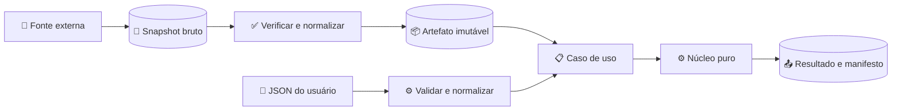

# Revisão adversarial e pré-mortem da fundação

_Síntese de três revisões internas por agentes, sem independência humana externa · 8 de agosto de 2026_

---

## 📋 Decisão executiva

**Decisão consolidada: `NO-GO` para implementação ampla, package público ou claim SOTA; `GO` condicionado para redesenhar e concluir a Fase 0.**

O blueprint original tem uma tese forte — núcleo local, auditável, modular e separado de prescrição —, mas a primeira especificação ainda permitia erros materialmente perigosos: misturar datas de valuation, ponderar sobrevivência duas vezes, contar o mesmo recurso como estoque e renda, otimizar com informação futura e selecionar regra jurídica por um intervalo de vigência insuficiente.

Esses achados não significam que o projeto deva ser abandonado. Significam que o próximo produto não é código: é um conjunto de **contratos normativos, casos analíticos, ledgers de autoridade/licença, threat model e gates de implantação**.

Formulação pública permitida nesta fase:

> **Blueprint científico de alta ambição, orientado à fronteira e ainda não validado.**

### Estado da remediação documental

Os achados foram incorporados à especificação, ADRs, arquitetura, ledgers, políticas de privacidade/model risk/licença e catálogo de reason codes. Desde a revisão original, o checkout materializou como candidatos draft 10 schemas Draft 2020-12, 33 casos de conformance e 62 reason codes, além do corpus local de vetores matemáticos. Isso reduz ambiguidade e torna controles testáveis, mas não estabelece validade científica: reconciliação independente suficiente, duas derivações para cada caso material, revisão humana externa e benchmark aprovado ainda não existem. Portanto, o veredito `NO-GO` para código amplo/release permanece.

Formulações proibidas nesta fase:

- “SDK SOTA” ou “motor de estado da arte” como fato já demonstrado;
- “cálculo válido” sem qualificador computacional e de escopo;
- “capital necessário” quando o objeto é apenas valor presente atuarial esperado;
- “explicação causal” para atribuição produzida pelo próprio modelo;
- “não regulado por ser educacional/open source”.

## 🔍 Composição e método do painel

Três agentes internos foram executados em frentes separadas e somente leitura. “Painel” é uma abreviação editorial para essas personas adversariais; não significa revisores humanos externos, independência institucional ou aprovação de domínio:

| Frente | Personas combinadas | Pergunta adversarial |
| --- | --- | --- |
| **Matemática e atuária** | financial economist, atuário, quant e pesquisador de household finance | as equações podem subcapitalizar, duplicar ou usar informação impossível? |
| **Brasil e regulação** | regulatório CVM, tributário/previdenciário, DPO, Open Finance/Insurance e licenças | o desenho representa vigência, autoridade, consentimento e uso material? |
| **Scientific software** | arquiteto, mantenedor Python, model risk, AppSec e product pre-mortem | o contrato pode virar um pacote seguro, reproduzível e mantível? |

Cada agente revisou os artefatos então existentes, buscou contraprovas, classificou severidade e produziu sinais precoces e mitigação. Os agentes não editaram o repositório naquela rodada. A síntese resultante é evidência interna de revisão, não substituto de atuário, jurista, DPO, model-risk reviewer ou AppSec humano independente.

### Normalização de severidade

A frente matemática chamou cinco achados de `P0` por bloquearem validade científica. As frentes de software e regulação os classificaram como `P1` operacional porque ainda não havia código, release ou usuários. A síntese usa:

- **B0 — bloqueador de contrato:** nenhuma implementação do domínio afetado pode começar;
- **B1 — bloqueador de fundação/release:** nenhuma publicação ou integração pode ocorrer;
- **B2 — obrigatório antes de beta:** pode ser especificado depois do núcleo, mas não omitido do escopo declarado;
- **B3 — higiene e melhoria:** baixo risco imediato, ainda rastreado.

## ❌ Bloqueadores B0 do contrato científico

### Horizonte e numéraire

A primeira equação de contribuição definiu necessidade em valor presente e depois subtraiu `K_T` de riqueza em valor futuro, usando `T` com dois sentidos. A convenção corrigida deve reservar:

- $t_0$ — data-base;
- $r$ — data de aposentadoria;
- $\omega$ — horizonte terminal;
- $\tau_a,\tau_b$ — tempos aleatórios de morte.

Todo valor precisa de `ValuationContext`: data, moeda, unidade real/nominal, medida de probabilidade, deflator/pricing kernel, finalidade e tratamento de sobrevivência. `market_net_worth`, `best_estimate_funding_surplus` e `certainty_equivalent_surplus` são objetos distintos.

### Sobrevivência e shortfall

Se morte é simulada e o déficit já é zero depois do óbito, não se multiplica novamente por sobrevivência. Se mortalidade é integrada analiticamente, usam-se probabilidades dos estados familiares. As duas abordagens são mutuamente exclusivas na mesma métrica.

O modelo de casal precisa dos estados `AB`, `A`, `B` e `none`, cada um com consumo, renda, reversão e legado próprios. Uma “vida equivalente” não basta.

### Proveniência econômica

Uma proibição textual de dupla contagem não é controle. Cada claim deve carregar origem, conta, natureza estoque/fluxo, bruto/líquido e componente de valuation. Transferências não criam riqueza; cupom distribuído não é renda externa quando o preço do ativo já incorpora a distribuição.

O contrato deve rejeitar o mesmo `economic_source_id` em capital humano, benefício e conta quando representa o mesmo direito econômico.

### Não-antecipatividade

Decisões multiperíodo precisam ser mensuráveis em relação à informação disponível na data. Em árvore de cenários, trajetórias com a mesma história até $k$ devem receber a mesma ação em $k$. Uma solução _wait-and-see_ é apenas um bound diagnóstico — superior em maximização e inferior em minimização, conforme a convenção —, nunca política implementável.

### Ledger orientado a eventos

A recorrência original confundiu retorno total com renda e ganho separados e, ao mesmo tempo, fixou uma ordem de eventos que dizia ser parametrizada. O contrato passa a exigir eventos ordenados e reconciliação por identidade stock-flow, com `return_basis`, `income_treatment`, `tax_event_timing`, `fee_accrual_basis` e `event_order`.

### Métricas sem colisão semântica

`Expected shortfall` estava sendo usado para:

- déficit médio incondicional;
- déficit médio condicionado à falha;
- média de perdas na cauda/CVaR.

A sigla `ES` fica reservada à perda média de cauda, com domínio, convenção de perda e nível $\alpha$. Nomes normativos:

```text
expected_deficit
conditional_mean_deficit
tail_expected_shortfall_alpha
survival_weighted_deficit
```

`funded_ratio` também vira família: razão de PVs esperados, esperança da razão e probabilidade de funding são métricas diferentes.

## ⚠️ Bloqueadores B1 de arquitetura, direito e governança

### Pipeline puro

O pipeline normativo passa a ser:



`compute` nunca recebe cliente HTTP, credencial, objeto conectado ou plugin dinâmico. O MVP aceita apenas JSON com tamanho/profundidade limitados. YAML, OFX, CSV e plugins vêm após threat model e parsers próprios.

### Contrato único

JSON Schema Draft 2020-12 é a fonte normativa draft proposta em `schemas/`. SDK e CLI futuros devem ser gerados ou testados por paridade. Validações semânticas que o schema não expressa ficam em validadores nomeados com reason codes; o tooling Python atual continua candidato e sem autoridade de aprovação.

### Bitemporalidade jurídica

`effective_from/effective_until` não representa publicação, eficácia, suspensão, decisão judicial, retroatividade ou momento em que o sistema conheceu uma mudança. Policy packs exigem eventos normativos, tempo de validade e tempo de conhecimento, status jurídico e revisão humana.

O caso IOF/VGBL de 2025–2026 demonstra a necessidade de estados `contested`, `suspended`, `restored`, `ex_tunc` e `ex_nunc`, além de um resultado `LEGAL_STATUS_UNKNOWN` quando não houver resolução aprovada.[^1][^2][^3]

### Deployment material, não nome de função

`compute`, `compare` e `explain` não são safe harbors. Uma comparação pode se tornar orientação individualizada se gerar alternativas, ordenar resultados, destacar a “melhor” carteira, tratar classes/valores mobiliários ou incluir CTA. A CVM aplica sua disciplina também a sistemas automatizados e algoritmos.[^4][^5]

O projeto passa a classificar deployments A–D, definidos em [deployment-classification.md](../governance/deployment-classification.md). O núcleo de pesquisa é classe A; recomendação regulada e execução permanecem bloqueadas no projeto-base.

### LGPD por implantação

Local-first reduz superfície; não cria conformidade. A implantação precisa identificar controlador, operador, finalidade, base legal, retenção, direitos, decisão automatizada, subprocessadores e incidentes. Saúde/incapacidade podem ser dados sensíveis; renda e patrimônio são dados pessoais, embora não sejam automaticamente “sensíveis” na definição legal.[^6]

O manifesto não deve conter PII nem hashes reversíveis de atributos de baixa entropia. Retenção e exclusão precisam reconciliar direitos do titular com obrigações regulatórias.

### Licença por recurso

ODbL pode exigir notice, share-alike de base derivada e oferta em formato legível por máquina; atribuição isolada não basta.[^7] Licença de um dataset BCB não se estende automaticamente a SGS/PTAX. B3 e ANBIMA têm termos contratuais por produto e podem restringir armazenamento, redistribuição e derivados.[^8][^9]

O código, o adapter e o dado são três objetos jurídicos separados. Nenhum snapshot real entra em wheel, teste ou documentação sem `DataLicenseManifest` aprovado.

### Threat model e supply chain

Antes de parser ou policy pack:

- limites de tamanho, profundidade e tempo;
- proteção contra traversal, symlink, decompression bomb e payload malicioso;
- packs data-only sem `eval` ou template executável;
- assinatura e trust root, pois checksum não prova autenticidade;
- redaction de logs e arquivos temporários;
- OIDC publishing, SBOM, attestations e dois mantenedores para release futuro.

## 📊 Lacunas B2 antes de beta

- motor explícito de anuidades e pooling de longevidade;
- mortalidade de coorte, frações de idade e modelos coerentes multipopulação;
- moradia, aluguel, hipoteca e iliquidez;
- saúde, morbidade, incapacidade e long-term care;
- oferta de trabalho e aposentadoria endógena;
- inflação específica do domicílio além de IPCA agregado;
- utilidade implementável, com domínio, escala familiar, legado e sensibilidade;
- tributação por lotes potencialmente MILP/MINLP com bounds e `mip_gap`;
- rolling-origin, holdout congelado, proper scoring rules e incerteza de parâmetro/modelo;
- corpus normativo completo para RGPS, PGBL/VGBL, IRPF, Open Finance e Open Insurance;
- licença específica do recurso IBGE antes de redistribuição.

Esses itens podem ser excluídos de um release desde que a exclusão seja explícita. Não podem ser escondidos enquanto o produto afirma cobrir o planejamento ao longo da vida.

## 📈 Pré-mortem consolidado

| Falha provável | Sinal precoce | Mitigação/gate |
| --- | --- | --- |
| AEPV vendido como capital garantidor | necessidade cai fortemente com maior mortalidade | tipos `actuarial_epv`, `self_insurance_capital`, `annuity_premium` |
| sobrevivência ponderada duas vezes | caso 50% × déficit 100 retorna 25 | escolher simulação ou integração analítica |
| ativo e renda duplicados | cupom aumenta riqueza de 100 para 110 | DAG de claims e teste stock-flow |
| otimizador usa futuro | ações divergem antes do choque observado | filtration e non-anticipativity tests |
| casal vira uma vida | nada muda após primeiro óbito | estados AB/A/B/none |
| utility escolhe qualquer resposta | ranking inverte com pequeno gamma | shortfall primário e sensitivity envelope |
| policy pack erra IOF/tributo | só há `effective_from` | eventos bitemporais e status contestado |
| notícia do INSS vira norma | casos especiais divergem do CNIS | corpus normativo e `indeterminate` fora do suporte |
| base derivada viola ODbL | benchmark sem notice/share-alike | Data BOM e revisão de banco derivado |
| B3/ANBIMA exige cessação | fixture real no Git ou scraping no CI | dados sintéticos e contrato por recurso |
| SaaS chama comparação de recomendação | ranking, selo “melhor”, CTA | deployment gate e counsel |
| PII aparece em logs/issues | inputs reais em bug report | redaction, exemplos sintéticos e PII scanning |
| consentimento revogado é reutilizado | token ativo após revogação | state machine e vault externo |
| pack adulterado passa checksum | hash confere para origem não confiável | assinatura, allowlist e trust root |
| SDK/CLI/schema divergem | campos ou erros diferentes | fonte normativa e parity tests |
| seed falha entre sistemas | mesmo seed, hash diferente | classes de reprodução e CI cross-platform |
| otimizador vence só in-sample | pesos extremos e ranking instável | rolling/nested evaluation e perturbation tests |
| release fica preso a uma pessoa | só um owner entende policy/modelo | owners por domínio e recovery de chaves |
| marketing precede evidência | README vira principal “benchmark” | protocolo pré-registrado e relatório de derrotas |

## 🎯 Roadmap revisado

### Gate F0 — fundação corrigida

- resolver todos os B0;
- JSON Schema, error catalog, glossário e manifesto;
- 20–30 vetores fechados;
- ADR de valuation/sobrevivência;
- bitemporal policy schema;
- ledgers regulatório e de licença;
- threat model;
- disclaimers e classificação de deployment;
- decisão humana de licença e governança de contribuição.

### Release 0.0.x — contratos, sem motor público

Publica apenas schemas, corpus, reason codes, model cards e política de compatibilidade. Gate: cada vetor material reconciliado por derivação analítica ou duas implementações independentes.

### Release 0.1 — núcleo determinístico

Somente JSON, quantidades/dinheiro, datas, taxas/fatores, cashflows, curvas fornecidas pelo usuário, PV/FV, necessidade determinística e comandos `validate/compute`. Sem rede, YAML, INSS, imposto, mortalidade estocástica ou otimização.

### Release 0.2 — primitivas brasileiras

Calendário versionado, `BUS/252`, indexadores e artefatos externos produzidos fora do núcleo. Gate: licença, autenticidade, bitemporalidade e testes de overlap/gap/expiry.

### Release 0.3 — ciclo de vida determinístico/research

Mortalidade oficial, estados familiares, renda necessária, regras simples de desacumulação, anuidades como benchmark e métricas com nomes inequívocos.

### Release 0.4 — estocástico experimental

RNG, cenários, convergência, incerteza, challengers e stresses. Sem política prescritiva padrão.

INSS, tributação, PGBL/VGBL, seguros e otimização têm releases/gates próprios. `1.0` exige histórico beta, revisão externa, segurança de release e nenhum bloqueador crítico.

## 🔐 Papel correto dos disclaimers

Os documentos [DISCLAIMER.md](../../DISCLAIMER.md), [PRIVACY.md](../../PRIVACY.md), [MODEL_RISK.md](../../MODEL_RISK.md) e [DATA_LICENSES.md](../../DATA_LICENSES.md) delimitam finalidade, informam riscos e criam um contrato auditável de produto.

Eles não:

- concedem autorização CVM, SUSEP ou BCB;
- cumprem suitability;
- criam base legal LGPD;
- substituem consentimento Open Finance/Open Insurance;
- concedem licença B3/ANBIMA;
- garantem cálculo tributário, previdenciário ou atuarial;
- alteram o enquadramento produzido pelo uso real.

O comportamento precisa ser testado contra os disclaimers. “Sem rede por padrão” exige teste de zero chamadas; “sem recomendação” exige ausência de campos `best`, `recommended`, CTA e ranking prescritivo na classe A.

## ✅ Disposição dos achados

| Disposição | Conteúdo |
| --- | --- |
| **Aceito agora** | B0 matemáticos; pipeline puro; bitemporalidade; deployment A–D; LGPD por papel; manifests de licença; disclaimers; status neutros |
| **Aceito para gate posterior** | anuidades, housing, saúde/LTC, trabalho endógeno, utility, MIP tributário e modelos multipopulação |
| **Dependente de humano** | licença do código, modelo de negócio/deployment, casos jurídicos suportados, counsel, DPO e parceiros regulados |
| **Rejeitado** | usar disclaimer como escudo; criar package antes dos contratos; chamar biblioteca externa de verdade/oráculo; claim SOTA sem benchmark |

## 🔗 Referências

[^1]: Brasil. (2025). “Decreto 12.499.” <https://planalto.gov.br/ccivil_03/_ato2023-2026/2025/decreto/d12499.htm>

[^2]: Congresso Nacional. (2025). “Decreto Legislativo 176.” <https://www2.camara.leg.br/legin/fed/decleg/2025/decretolegislativo-176-26-junho-2025-797660-norma-pl.html>

[^3]: STF. “ADC 96 e ações conexas.” <https://portal.stf.jus.br/processos/detalhe.asp?incidente=7303647>

[^4]: CVM. “Resolução CVM 19 — texto consolidado.” <https://conteudo.cvm.gov.br/export/sites/cvm/legislacao/resolucoes/anexos/001/resol019consolid.pdf>

[^5]: CVM. “Resolução CVM 30 — texto consolidado.” <https://conteudo.cvm.gov.br/export/sites/cvm/legislacao/resolucoes/anexos/001/resol030consolid.pdf>

[^6]: Brasil. “Lei 13.709 — LGPD.” <https://www.planalto.gov.br/ccivil_03/_ato2015-2018/2018/lei/l13709compilado.htm>

[^7]: Open Data Commons. “Open Database License 1.0.” <https://opendatacommons.org/licenses/odbl/1-0/>

[^8]: B3. (2026). “Política de Consumo de Market Data.” <https://www.b3.com.br/data/files/A0/D0/A2/FD/F441B9105B12E5A9AC094EA8/Politica%20de%20Consumo%20Market%20Data%20B3.pdf>

[^9]: ANBIMA. “Termos de uso ANBIMA Feed — segmento do investidor.” <https://www.anbima.com.br/pt_br/informar/termos-de-uso-anbima-feed-segmento-do-investidor.htm>

---

_Última atualização: 9 de agosto de 2026_
