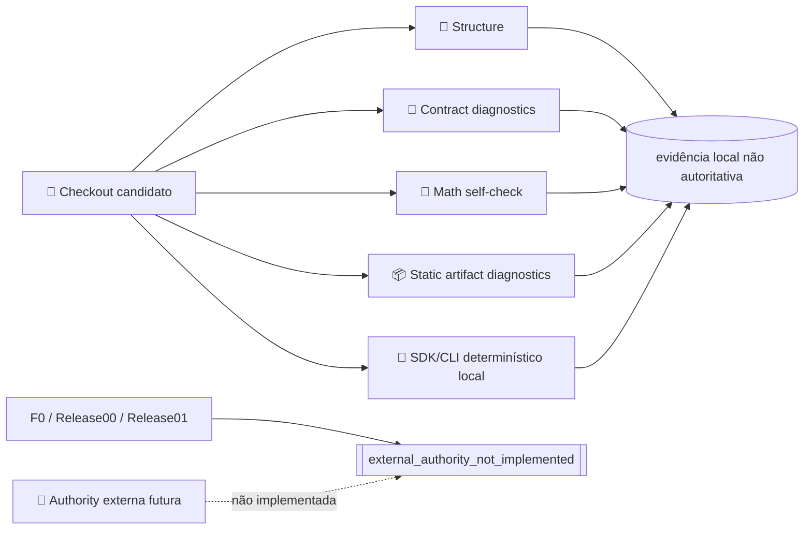

# Threat model da fundação

_Escopo: contratos, conformance tooling e futura cadeia de release · 30 de agosto de 2026_

## 📋 Estado e objetivo

Há tooling executável de contratos/documentação/matemática/artefatos e um SDK/CLI local para PV e ledger determinístico. Não há motor amplo, regra brasileira, serviço, authority ou release. Todo esse código é candidato; cálculo concluído não constitui boundary de autoridade.

Objetivos:

- impedir que um diagnóstico local se apresente como aprovação ou release;
- limitar parsing, paths, subprocessos e consumo de recursos;
- manter PII fora do núcleo, logs, fixtures e manifestos;
- impedir rede, persistência implícita ou ação financeira no `validate/compute deterministic` atual;
- definir o mínimo necessário antes de integrar autoridade, build ou publicação externos.

## 👤 Atores e ativos

### Atores

- usuário local legítimo e aplicação hospedeira;
- mantenedor, reviewer e counsel futuros;
- provedor de dado/política;
- contribuidor malicioso ou conta/host comprometidos;
- atacante que controla arquivo, dependência, runtime, startup config ou processo same-UID;
- downstream que remove warnings ou promove draft.

### Ativos

- payload pessoal e artefatos locais;
- regras, parâmetros e status jurídicos;
- datasets, licenças e proveniência;
- schemas, vetores, manifestos e resultados diagnósticos;
- futuras raízes/chaves de assinatura e identidade PyPI/GitHub;
- integridade das equações e limites de uso.

## 🔐 Fronteiras atuais

`validate_docs.ps1` aceita apenas a gramática lexical fechada de processo novo `powershell|pwsh -NoProfile ... -File <gate> -Mode <modo>`. Switches, modos, ordem e as duas grafias relativas são `Ordinal` exatos; somente o path absoluto usa identidade case-insensitive no filesystem Windows. Structure pode passar; F0/00/01 chamam `[Environment]::Exit(1)` antes da boundary de host, de autoload, import, helper ou leitura. Toda rota não canônica chama `[Environment]::Exit(2)`; `&` e dot-source são proibidos porque encerram o próprio host invocador, sem continuação do wrapper.

O SDK rejeita campos desconhecidos, floats JSON, chaves duplicadas, input excessivo, datas inválidas, moeda diferente de BRL e uso client-specific/recomendação/execução. A CLI lê um único arquivo regular por handle, limita bytes/nós/profundidade, não ecoa o valor rejeitado e grava output explicitamente por replace atômico. O runtime não importa cliente HTTP/DNS/socket/subprocesso e não persiste input. Isso reduz superfície; não protege contra Python/OS comprometido nem transforma hash/JSON em anonimização.

Somente Structure verifica o host: Windows PowerShell sob o path esperado de `System32` ou PowerShell Core sob as subárvores aceitas de `Program Files`, com executável/argv/`PSHOME`/manifests builtin coerentes e cadeias sem reparse. Host copiado para `%TEMP%`, host desconhecido e Linux/macOS são RC2 antes de import; administrador e PowerShell engine comprometidos estão fora da boundary declarada. A raiz, ancestrais e toda entrada do checkout também precisam estar livres de symlink/junction/reparse, e a traversal não segue a entrada rejeitada. Só depois, autoload é desabilitado, `PSModulePath` do processo é esvaziado, os módulos builtin Management/Utility são importados por manifests absolutos sob `$PSHOME` e os comandos são qualificados. O script não lê resultado/chave, não verifica Ed25519, não executa runtime informado e não inicia validator candidato. `validate_release_trust.py` é stub sem imports/I/O e retorna 2. Portanto nenhuma saída local autoriza promoção.

## ⚠️ Findings de authority que motivaram o decommission

| Ameaça demonstrada | Falha do protótipo v2/v3/v4 | Controle atual |
| --- | --- | --- |
| import/startup injection | fake `cryptography`/hashlib/sitecustomize podia influenciar Python candidato | Python de contratos é apenas diagnóstico; não há verifier Python de authority |
| runtime circular | executável descrito pelo payload participava da autenticação do próprio payload | gate não aceita runtime ou payload externo |
| closure não autenticada | executable pin não cobria `._pth`, stdlib, loader e startup config | bootstrap removido; future closure precisa de autenticação OOB |
| guard mutável | flags/estado de startup podiam ser forjados dentro da mesma boundary | não há guard de authority nem decisão local; o guard de invocação apenas delimita o diagnóstico candidato |
| signer onipotente | signer do envelope final podia fabricar math/build/quórum aninhados | nenhum envelope é aceito; futuro exige relatórios de domínio com assinaturas aninhadas **e** threshold/quórum independente |
| wrapper/alias/dot-source/host copiado | alias `Add-Failure`, state priming, `-ErrorAction` ou módulo builtin adulterado podiam apagar falhas e produzir PASS | argv/path canônicos via APIs .NET; invocação não canônica chama `Environment.Exit(2)`; Structure exige instalação Windows protegida e árvore sem reparse antes de sanitizar discovery/import, testado em PS 5.1/7.x |
| synthetic-to-real confusion | PKI e pessoas `test_only` conseguiam abrir F0/Release00 | PKI sintética removida; gates sempre falham |
| replay/inventário aberto | “commit atual” não fechava untracked, revisão autorizada e replay | nenhuma avaliação current; future source inventory precisa ser fechado |
| split-read e swap/restore | paths podiam mudar entre hash/parse/verify ou durante execução matemática | não há paths de resultado/chave nem filho math no gate |
| artefato opaco/arquivo poliglota | bibliotecas de alto nível podiam ignorar prefixos, records, streams concatenados ou extensões; assinatura de digest aceitava bytes junk como build claim | Release01 hard-fail; `ArtifactBlob` tuple+digest fixa bytes, parsers raw fecham ZIP32/gzip/USTAR e reconciliam a visão lógica; diagnóstico v3 limita claim a payload Python não atômico e mantém paridade ampla/build `not_evaluated` |

O controle atual é redução de autoridade, não resistência geral do host. Um atacante pode corromper diagnósticos locais; não pode obter uma decisão de release porque essa decisão não existe.

## ⚠️ Ameaças do tooling e controles locais

| Ameaça | Vetor | Controle local |
| --- | --- | --- |
| DoS de parser | JSON profundo/grande, números extremos | limites de bytes, profundidade, coleção e números |
| traversal/reparse/hardlink/ADS | host, checkout inteiro, schemas, corpus, manifests ou archives | instalação Windows suportada, root explícito, path regular, `nlink=1`, preflight integral e checks por harness; streams Win32 do inventário de examples são enumerados e rechecados no Windows, com `not_applicable` explícito fora dele |
| execução por formato | YAML tags, template, `eval`, plugin | JSON-only; packs data-only |
| archive ambíguo/decompression bomb | wheel/sdist hostil | `ArtifactBlob` imutável; ZIP32 gap-free com consumo integral, tamanho/CRC e reconciliação raw/biblioteca, além de gzip/USTAR raw estritos; features não modeladas, paths Win32 ambíguos, tipos especiais e budgets falham antes da claim |
| exfiltração | módulo SUT, logs, temporários | sem claim de isolamento local; SUT hostil requer sandbox externo |
| dado contaminado | schema válido sem proveniência | checksum, source ID, flags e quarantine |
| warning removido | downstream altera relatório | status/reason codes estruturados; downstream permanece fora da boundary |
| recomendação indevida | ranking/CTA adicionado | deployment classification e schemas sem campos prescritivos |
| side channel | erro contém payload | mensagens por path/código e scanners heurísticos; sem PII real |
| float/rounding silencioso | número JSON binário ou arredondamento em estágio implícito | decimais financeiros como strings, `Decimal`, quantum monetário e `ROUND_HALF_EVEN` em fronteira declarada |
| dupla contagem de retorno | total return mais distribuição/income separado | convenção por conta/evento e rejeição semântica da combinação |
| transferência cria riqueza | uma perna ausente ou conta incorreta | evento único gera duas postagens opostas e reconciliação consolidada exata |
| backend de build vulnerável ou divergente | sdist inclui arquivo não intencional ou metadata muda silenciosamente | `setuptools==84.0.0`, metadata policy v5 com licença source-bound, roster raw/canônico fechado e dependency review candidato; lock transitivo com hashes ainda é gap |
| workflow ou action comprometida | tag móvel, token de checkout ou permissão ampla | actions por SHA integral, `persist-credentials: false`, permissões explícitas, timeouts e testes estáticos do YAML |
| credencial de publicação prematura | secret ou comando transforma diagnóstico em release | nenhum secret/comando de publicação nos workflows; GitHub Environments, OIDC e registry permanecem ausentes por desenho |

O scan local com Gitleaks conserva uma única exceção por fingerprint em `.gitleaksignore`: o token deliberadamente sintético do fixture negativo `input-adversarial-sensitive-and-decimal.json`. A exceção liga arquivo, regra e linha; qualquer outro achado, inclusive drift desse fixture, permanece bloqueante. Isso não substitui o secret scanning e o push protection do remoto.

## ⚙️ Requisitos antes de release 0.1

- JSON UTF-8, schema e validação semântica antes do domínio;
- tetos rígidos de bytes, profundidade, CPU/memória/iterações;
- nenhum HTTP/DNS/socket nos processos `validate/compute`;
- nenhum plugin discovery ou execução dinâmica;
- output para stdout ou path explícito com escrita atômica;
- erros sem echo de valores pessoais;
- dependências mínimas pinadas com hashes em CI/release;
- sdist/wheel inspecionados contra secrets, binaries e `RECORD` divergente;
- CI Windows/Linux e teste real de rede bloqueada;
- authority externa com closure, fonte, clock/freshness e quórum autenticados fora de banda;
- package e provenance assinados apenas quando houver autorização humana de publicação.

## 🧪 Casos adversariais atuais

- F0/Release00/Release01 com documentos humanos falsos continuam vermelhos;
- cada argumento legado de bootstrap é recusado antes do corpo do PowerShell;
- result/key concorrentes não têm consumer;
- replacements de contract/math/artifact/trust registram zero execução pelo gate;
- casing/abreviação de switch, modo ou path relativo, common parameters, nested/module/pipeline e `-Command` retornam RC2 sem PASS nem decisão em PS 5.1/7.x; casing alternativo apenas do path absoluto Windows preserva a mesma identidade de filesystem; tentativas por `&` ou dot-source encerram o host RC2 antes de qualquer marcador posterior;
- host PowerShell copiado/adulterado em `%TEMP%` retorna RC2 antes de importar o módulo hostil; host desconhecido e Structure em Linux/macOS também não têm caminho suportado;
- `PSModulePath` hostil e módulos decoy não redirecionam Structure: a boundary de instalação é verificada, autoload é desabilitado, o path de módulos do processo é esvaziado e os módulos builtin são importados por path absoluto;
- junction na raiz ou em qualquer entrada do checkout falha sem atravessar a árvore externa;
- stub ignora private key, policy, runtime, Git e output paths sem I/O;
- inspector rejeita o antigo digest de attestation no argparse e nunca emite `passed`/equivalência de build;
- startup marker não roda sob a invocação isolada do stub;
- schema mutado após snapshot usa bytes congelados e falha no recheck final;
- Structure falha em markdown vazio/marker Unicode, checksum zero/mismatch e relação jurídica inválida; scans legados usam FormKC e removem `Cf`, e o histórico exige roster fechado de sete H2 em ordem `Ordinal`;
- math mantém testes de hardlink/reparse, mutation snapshot, timeouts e limites de isolamento;
- supervisor de subprocesso mantém o candidato atrás de gate, publica o owner antes de `Popen.__init__`, aplica Job Object/process group, drena stdout/stderr concorrentemente por cap+1 e preserva cancelamento/cleanup; `setsid` POSIX, kernel/host comprometido e latência não preemptível do create ficam fora da claim;
- o source freeze recusa interpreter sem `-I`, pois `sitecustomize` pode executar antes do código do script; launchers suportados passam isolated mode explicitamente;
- cleanup Docker usa nomes/labels e a tag derivada do nonce, inclusive se `image inspect` ou o primeiro inventário falhar, e continua falhando fechado até verificar inventário final;
- contract probes rejeitam streams nomeados antes/depois do snapshot no Windows, tratam ADS como `not_applicable` em não Windows e recusam bullets de reason code variantes/confusáveis sem promover menções em prosa;
- archive inspector mantém traversal, bomb, symlink e executable probes; também prova a tuple imutável e o digest do `ArtifactBlob`, a bijeção raw ZIP32, consumo integral/CRC/tamanho de `stored`/`deflated` e reconciliação de metadata/bytes raw com `zipfile` antes de `RECORD`, um único gzip/USTAR, a recusa de ZIP64/descriptors/extras/comments/prefixos/orphans, PAX/GNU/sparse/links e paths Win32 ambíguos; fecha `.dist-info`/`.data`/diretórios explícitos e detecta drift final de dist/pyproject/src/tests. Antes de canonicalizar o sdist bruto, outro parser fecha a sequência PAX/logical e todos os campos USTAR contra o perfil coerente da célula Windows ou Linux, rejeitando base-256, tails pós-NUL, owner/group, profile cruzado, mtime desligado, padding/EOF alternativos e qualquer canal que o writer apagaria.

## 🔭 Authority futura

Uma nova integração exige threat model e ADR próprios. A boundary deve ficar fora do checkout, ser autenticada independentemente de todo payload candidato, fechar sua closure de execução e a fonte avaliada, e emitir relatórios separados para contratos, matemática e artefatos. Esses relatórios precisam de assinaturas de domínio aninhadas **e** threshold/quórum independente. Identidade humana, domínio, revogação/freshness e rollback precisam de evidência verificável; a assinatura final não substitui nenhum controle interno. Consulte a [fronteira de confiança operacional](../governance/release-trust.md); as tentativas R2–R11 permanecem somente no [histórico superseded](../history/trust-r2-r11-superseded.md).

Até lá, `external_authority_not_implemented` é o único estado seguro. Agent review é challenge interno declarado, não reviewer humano/independente nem authority. Há package local draft e licença Apache-2.0 para o source original, mas não há reviewer independente, chaves, atestações, sandbox hermético, `dist` autorizado ou release.

## 🔄 Manutenção

Atualizar este threat model quando surgir novo formato, adapter de rede, persistência, solver, plugin, geração de linguagem, deployment, integração consentida ou pipeline de publicação. Cada mudança associa ameaça, controle, teste, owner e prazo.

SLSA e OpenSSF Scorecard podem orientar uma futura provenance, nunca certificar esta fundação.[^1][^2]

## 🔗 Referências

[^1]: OpenSSF. “SLSA specification.” <https://slsa.dev/spec/>

[^2]: OpenSSF. “Scorecard.” <https://securityscorecards.dev/>
